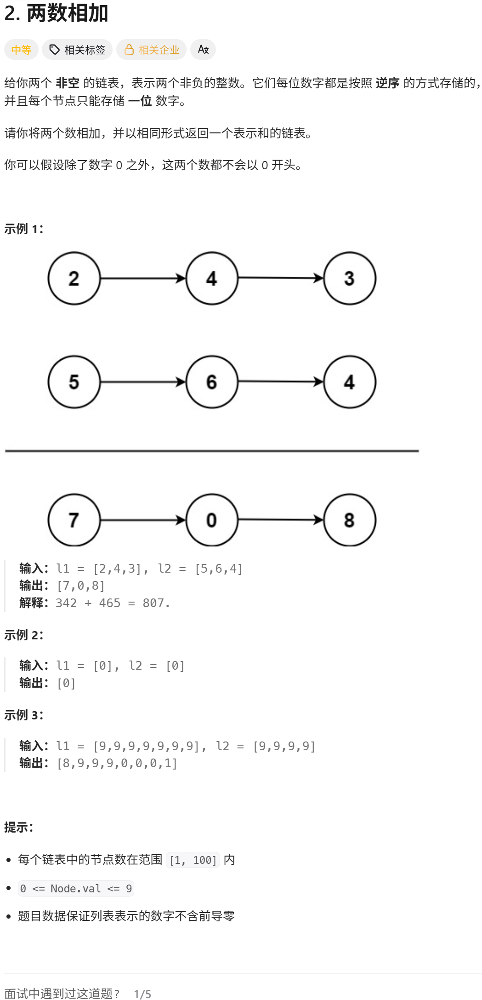

# 2. 两数相加

给你两个非空的链表，表示两个非负的整数。它们每位数字都是按照**逆序**的方式存储的，并且每个节点只能存储一位数字。

请你将两个数相加，并以相同形式返回一个表示和的链表。

你可以假设除了数字 0 之外，这两个数都不会以 0 开头。

---

## 示例 1

**输入：** `l1 = [2,4,3]`, `l2 = [5,6,4]`

**输出：** `[7,0,8]`

**解释：** 342 + 465 = 807



---

## 示例 2

**输入：** `l1 = [0]`, `l2 = [0]`

**输出：** `[0]`

---

## 示例 3

**输入：** `l1 = [9,9,9,9,9,9,9]`, `l2 = [9,9,9,9]`

**输出：** `[8,9,9,9,0,0,0,1]`

---

## 提示

- 每个链表中的节点数在范围 `[1, 100]` 内
- `0 <= Node.val <= 9`
- 题目数据保证列表表示的数字不含前导零

---

## 代码实现

```cpp
ListNode* addTwoNumbers(ListNode* l1, ListNode* l2) {
    ListNode* dummy = new ListNode();
    ListNode* curr = dummy;
    int carry = 0;
    while (l1 || l2 || carry) {
        int a = l1 ? l1->val : 0;
        int b = l2 ? l2->val : 0;
        int sum = a + b + carry;
        carry = sum >= 10 ? 1 : 0;
        curr->next = new ListNode(sum % 10);
        curr = curr->next;
        if (l1) l1 = l1->next;
        if (l2) l2 = l2->next;
    }
    return dummy->next;
}
```

---

## 思考思路

### 第一步：理解输入结构

比如：

- `L1 = 2 -> 4 -> 3`（代表 342）
- `L2 = 5 -> 6 -> 4`（代表 465）

注意链表头是个位，所以遍历时天然就是从低位到高位。

### 第二步：你需要什么

- 一个指针 `p` 指向 L1 的头，一个指针 `q` 指向 L2 的头。
- 一个变量 `carry` 表示进位，初始为 0。
- 一个新链表的虚拟头节点 `dummy`，方便操作。
- 一个当前节点指针 `curr` 用来构建新链表。

### 第三步：循环条件

只要 `p != null` 或 `q != null` 或 `carry != 0`，就继续加。

### 第四步：每一轮做什么

1. 取出 `p` 的值（如果 `p` 为空则取 0），取出 `q` 的值（如果 `q` 为空则取 0）。
2. 计算 `sum = val1 + val2 + carry`。
3. 新的节点值 `newVal = sum % 10`。
4. 更新进位 `carry = sum / 10`（整数除法）。
5. 创建新节点，接到 `curr` 后面。
6. `p` 和 `q` 各自后移（如果不为空）。

### 第五步：循环结束后

返回 `dummy.next`。

### 易错点提醒

- 别忘了最后可能还有一个进位，比如 `5 + 5 = 10`，最后要多一个节点 `1`。
- 两个链表长度不同时，短的链表后面视为 0。
- 链表节点值都是 0–9，不会出现负数。

### 总结

就是模拟手算加法，从个位开始，逐位相加并处理进位，直到两个链表都走完且进位为 0。
