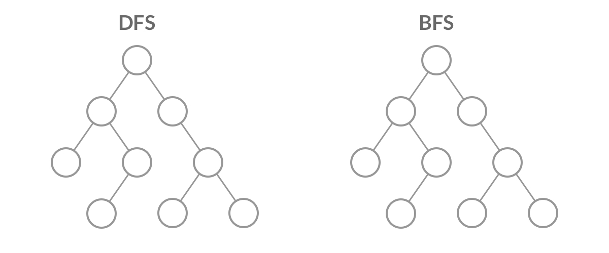
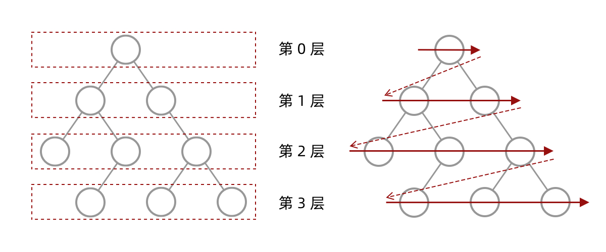
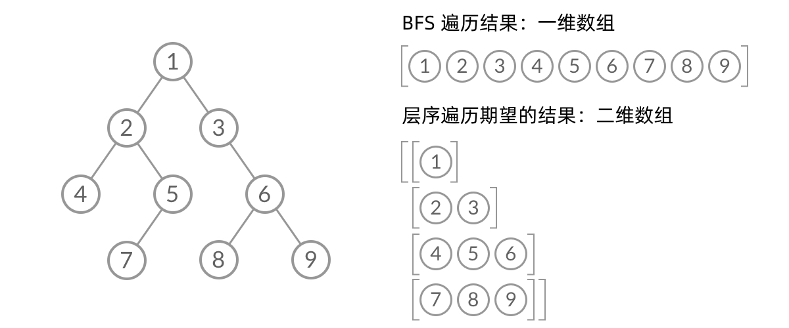
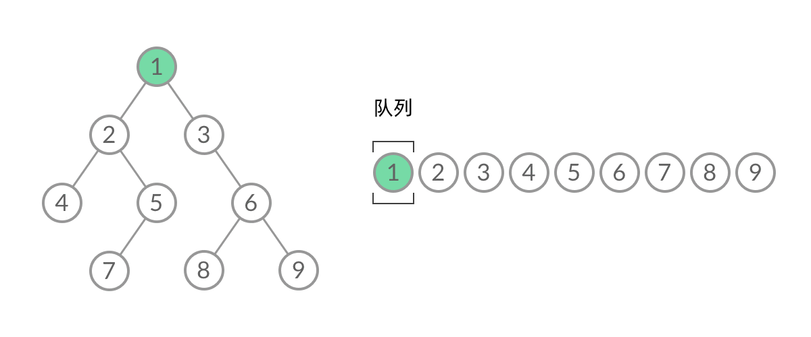
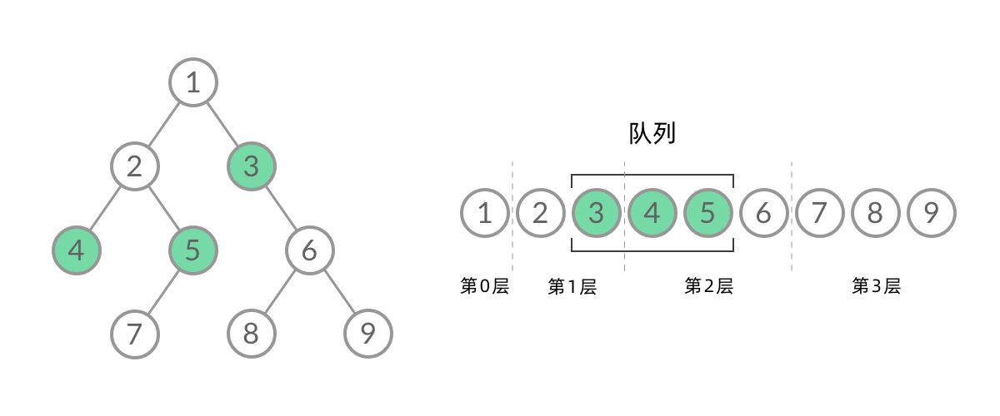
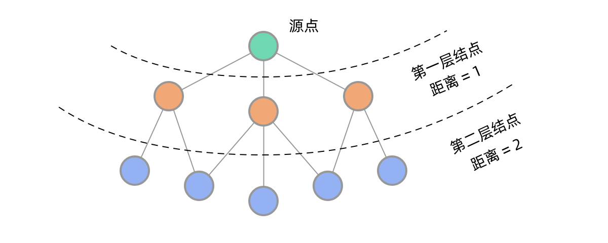

# 102. 二叉树的层序遍历

> [LeetCode 原题链接](https://leetcode.cn/problems/binary-tree-level-order-traversal/)

## 题目描述

给你二叉树的根节点 root ，返回其节点值的 层序遍历 。 （即逐层地，从左到右访问所有节点）。

### 示例 1

```text
输入：root = [3,9,20,null,null,15,7]
输出：[[3],[9,20],[15,7]]
```

### 示例 2

```text
输入：root = [1]
输出：[[1]]
```

### 示例 3

```text
输入：root = []
输出：[]
```

### 提示

- 树中节点数目在范围 [0, 2000] 内
- -1000 <= Node.val <= 1000

---

## 原文解题记录

**解题思路**

本文将会讲解为什么这道题适合用广度优先搜索（BFS），以及BFS适用于什么样的场景。

DFS（深度优先搜索）和BFS（广度优先搜索）就像孪生兄弟，提到一个总是想起另一个。然而在实际使用中，我们用DFS的时候远远多于BFS。那么，是不是BFS就没有什么用呢？

如果我们使用DFS/BFS只是为了遍历一棵树、一张图上的所有结点的话，那么DFS和BFS的能力没什么差别，我们当然更倾向于更方便写、空间复杂度更低的DFS遍历。不过，某些使用场景是DFS做不到的，只能使用BFS遍历。这就是本文要介绍的两个场景：「层序遍历」、「最短路径」。

本文包括以下内容：

- DFS与BFS的特点比较

- BFS的适用场景

- 如何用BFS进行层序遍历

- 如何用BFS求解最短路径问题

- DFS与BFS

**二叉树上进行DFS遍历和BFS遍历的代码比较**

DFS遍历使用**递归：**

void dfs(TreeNode root) {

if (root == null) {

return;

}

dfs(root.left);

dfs(root.right);

}

BFS遍历使用**队列**数据结构**：**

void bfs(TreeNode root) {

Queue<TreeNode> queue = new ArrayDeque<>();

queue.add(root);

while (!queue.isEmpty()) {

TreeNode node = queue.poll(); // Java 的 pop 写作 poll()

if (node.left != null) {

queue.add(node.left);

}

if (node.right != null) {

queue.add(node.right);

}

}

}

只是比较两段代码的话，最直观的感受就是：DFS遍历的代码比BFS简洁太多了！这是因为递归的方式隐含地使用了系统的**栈**，我们不需要自己维护一个数据结构。如果只是简单地将二叉树遍历一遍，那么DFS显然是更方便的选择。

虽然DFS与BFS都是将二叉树的所有结点遍历了一遍，但它们遍历结点的顺序不同。

<p align="center"></p>

这个遍历顺序也是BFS能够用来解「层序遍历」、「最短路径」问题的根本原因。

**BFS 的应用****一****：层序遍历**

BFS的层序遍历应用就是本题了：

**给定一个二叉树，返回其按层序遍历得到的节点值。 层序遍历即逐层地、从左到****右访问****所有结点。**

<p align="center"></p>

乍一看来，这个遍历顺序和BFS是一样的，我们可以直接用 BFS 得出层序遍历结果。然而，**层序遍历要求的输入结果和BFS是不同的**。层序遍历要求我们区分每一层，也就是返回一个二维数组。而BFS的遍历结果是一个一维数组，无法区分每一层。

<p align="center"></p>

那么，怎么给BFS遍历的结果分层呢？我们首先来观察一下BFS遍历的过程中，结点进队列和出队列的过程：

<p align="center"></p>

截取BFS遍历过程中的某个时刻：

<p align="center"></p>

可以看到，此时队列中的结点是3、4、5，分别来自第1层和第2层。这个时候，第1层的结点还没出完，第2层的结点就进来了，而且两层的结点在队列中紧挨在一起，我们无法区分队列中的结点来自哪一层。

因此，我们需要稍微修改一下代码，**在每一层遍历开始前，先记录队列中的结点数量n（也就是这一层的结点数量），然后一口气处理完这一层的n****个****结点。**

// 二叉树的层序遍历

void bfs(TreeNode root) {

Queue<TreeNode> queue = new ArrayDeque<>();

queue.add(root);

while (!queue.isEmpty()) {

int n = queue.size();

for (int i = 0; i < n; i++) {

// 变量 i 无实际意义，只是为了循环 n 次

TreeNode node = queue.poll();

if (node.left != null) {

queue.add(node.left);

}

if (node.right != null) {

queue.add(node.right);

}

}

}

}

这样，我们就将BFS遍历改造成了层序遍历。在遍历的过程中，结点进队列和出队列的过程为：

<p align="center"></p>

可以看到，在while循环的每一轮中，都是将当前层的所有结点出队列，再将下一层的所有结点入队列，这样就实现了层序遍历。

**BFS的应用二：最短路径**

**在一棵树中，一个结点到另一个结点的路径是唯一的，但在图中，结点之间可能有多条路径，**其中哪条路最近呢？这一类问题称为 最短路径问题。最短路径问题也是 BFS 的典型应用，而且其方法与层序遍历关系密切。

在二叉树中，BFS可以实现一层一层的遍历。在图中同样如此。从源点出发，BFS首先遍历到第一层结点，到源点的距离为1，然后遍历到第二层结点，到源点的距离为2…… 可以看到，用BFS的话，距离源点更近的点会先被遍历到，这样就能找到到某个点的最短路径了。

<p align="center"></p>

很多同学一看到「最短路径」，就条件反射地想到「Dijkstra算法」。为什么BFS遍历也能找到最短路径呢？

这是因为，Dijkstra算法解决的是带权最短路径问题，而我们这里关注的是无权最短路径问题。也可以看成每条边的权重都是1。这样的最短路径问题，用BFS求解就行了。

在面试中，你可能更希望写BFS而不是Dijkstra。毕竟，敢保证自己能写对Dijkstra算法的人不多。

最短路径问题属于图算法。由于图的表示和描述比较复杂，本文用比较简单的网格结构代替。网格结构是一种特殊的图，它的表示和遍历都比较简单，适合作为练习题。在LeetCode中，最短路径问题也以网格结构为主。

**总结**

可以看到，「BFS 遍历」、「层序遍历」、「最短路径」实际上是递进的关系。**在BFS遍历的基础上区分遍历的每一层，就得到了层序遍历。在层序遍历的基础上记录层数，就得到了最短路径。**

BFS遍历是一类很值得反复体会和练习的题目。一方面，BFS遍历是一个经典的基础算法，需要重点掌握。另一方面，我们需要能根据题意分析出题目是要求最短路径，知道是要做BFS遍历。
