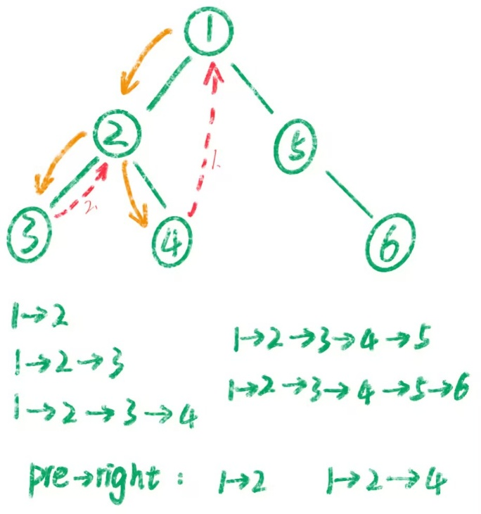

# 114. 二叉树展开为链表

> [LeetCode 原题链接](https://leetcode.cn/problems/flatten-binary-tree-to-linked-list/)

## 题目描述

给你二叉树的根结点 root ，请你将它展开为一个单链表：

- 展开后的单链表应该同样使用 TreeNode ，其中 right 子指针指向链表中下一个结点，而左子指针始终为 null 。
- 展开后的单链表应该与二叉树 先序遍历 顺序相同。

### 示例 1

```text
输入：root = [1,2,5,3,4,null,6]
输出：[1,null,2,null,3,null,4,null,5,null,6]
```

### 示例 2

```text
输入：root = []
输出：[]
```

### 示例 3

```text
输入：root = [0]
输出：[0]
```

### 提示

- 树中结点数在范围 [0, 2000] 内
- -100 <= Node.val <= 100

进阶：你可以使用原地算法（O(1) 额外空间）展开这棵树吗？

---

## 原文解题记录

**方法****一****：****Morris前序遍历（****尾插法****）**

**尾插：****每次都是把当前节点接到链表最后一个节点的右边，也就是追加到末尾。**

可以发现展开的顺序其实就是二叉树的先序遍历。算法和94题中序遍历的**Morris算法****（线索）**有些神似，我们需要两步完成这道题。

**问：****Morris能不能头插****？**

答：不能。

Morris遍历的核心是沿着原树的指针顺序移动，每次只处理当前节点，无法把一整段子树整体插到前面。头插需要提前知道左子树的边界并整体移动，这和Morris逐节点推进的逻辑矛盾。

<p align="center"></p>

我们用Morris前序遍历来走一遍 root = [1,2,5,3,4,null,6]

**第1步：cur = 1**

cur有左子树（节点2）。找到左子树最右节点：节点4（4->right == null）。

第一次遇到cur，访问节点1。建立线索：4->right = 1。然后cur = cur->left = 2。

**第2步：cur = 2**

cur有左子树（节点3）。找到左子树最右节点：节点3（3->right == null）。

第一次遇到cur，访问节点2。建立线索：3->right = 2。然后 cur = cur->left = 3。

**第3步：cur = 3**

cur 没有左子树。

访问节点3。

然后 cur = cur->right = 2（通过线索回到节点2）。

**第4步：cur = 2**

cur 有左子树（节点3）。找到左子树最右节点：节点3。此时 3->right == 2，不为空，**说明是第二次遇到cur。**

断开线索：3->right = null。然后cur = cur->right = 4。

**第5步：cur = 4**

cur没有左子树。

访问节点4。然后 cur = cur->right = 1（通过线索回到节点1）。

**第6步：cur = 1**

cur 有左子树（节点2）。找到左子树最右节点：节点4。此时 4->right == 1，不为空，**说明是第二次遇到cur。**

断开线索：4->right = null。然后 cur = cur->right = 5。

**第7步：cur = 5**

cur有左子树吗？没有（左孩子为null）。

访问节点5。然后 cur = cur->right = 6。

**第8步：cur = 6**

cur 没有左子树。

访问节点6。然后 cur = cur->right = null，结束。

if (cur->left == nullptr)

访问 cur;           // 把当前节点连接到结果链表的末尾

cur = cur->right;

else

找 pre;

if (pre->right == nullptr)

访问 cur;          // 第一次遇到就访问

建立线索;

cur = cur->left;

else

断开线索;

// 这里不需要再访问cur，因为第一次已经访问过了

cur = cur->right;

```cpp
class Solution {

public:

void flatten(TreeNode* root) {

TreeNode* cur = root;

TreeNode* prev = nullptr;  // 用于连接链表

while (cur != nullptr) {

if (cur->left != nullptr) {

TreeNode* pre = cur->left;

while (pre->right != nullptr && pre->right != cur) {

pre = pre->right;

}

if (pre->right == nullptr) {

// 建立线索 + 前序访问

if (prev != nullptr) {

prev->right = cur;

prev->left = nullptr;

}

prev = cur;

pre->right = cur;

cur = cur->left;

} else {

// 断开线索

pre->right = nullptr;

cur = cur->right;

}

} else {

// 访问 cur —— 在这里写连接代码

if (prev != nullptr) {

prev->right = cur;

prev->left = nullptr;

}

prev = cur;

cur = cur->right;

}

}

}

};
```

当“访问”当前节点cur时，要做三件事：

prev->right = cur;  // 把cur接到链表**尾部**

prev->left = nullptr;  // 左指针置空（题目要求）

prev = cur;  // 更新prev为新的尾部，方便进入下一次访问

- **建立线索指的是？**

就是把当前节点左子树中最右边那个节点的右指针，指向当前节点。pre->right = cur;

- **断开线索指的是？**

就是把当前节点左子树中最右边那个节点的右指针置空。

- **如果右指针不为空的话，为什么要断开线索****？**

因为当右指针不为空时，**说明这个线索是你之前建立的，**意味着左子树已经遍历完了，现在是通过线索回到了当前节点。

这时候如果不断开线索，就会形成环，导致死循环。而且题目要求最终把树改成链表，如果保留线索，树的结构就不对了。

具体来说：

第一次遇到 cur 时，pre->right 为空，你建立线索，然后往左走。

第二次遇到 cur 时（通过线索回来的），pre->right 不为空，说明左子树已经处理完毕，此时需要断开线索（把 pre->right 重新置空），恢复原状，然后 cur 往右走。

所以断开线索的作用就是：**标记左子树处理完成，防止死循环，并恢复树的原始结构。**

**太麻烦了，超时了，只是节省空间为O（1）**

**方法****二****：头插法**

采用头插法构建链表，也就是从节点6开始，在6的前面插入5，在5的前面插入4，依此类推。

为此，要按照 6→5→4→3→2→1 的顺序**访问**节点。如何遍历二叉树，才能实现这个顺序？

开始时我不懂什么叫做**访问**？

既然 1→2→3→4→5→6 是先序遍历，那么 6→5→4→3→2→1 就是先序遍历的逆序，即按照**右-左-根**的顺序遍历二叉树。（这个就是访问）

遍历的同时执行头插法，把当前节点插在链表头（根）节点head的前面，然后更新head为当前节点。一开始head是空节点。

| 1<br>/ \<br>2   5<br>/ \   \<br>3   4   6 | 1<br>/ \<br>2   5<br>/ \   \<br>3   4   6 |
| --- | --- |
| //将 1 的左子树插入到右子树的地方<br>1<br>\<br>2         5<br>/ \         \<br>3   4         6 | **//将原来****的右子树****接到左子树的最右边节点**<br>**    1**<br>**     \**<br>**      2          **<br>**     / \          **<br>**    3   4  **<br>**         \**<br>**          5**<br>**           \**<br>**            6** |
| //将 2 的左子树插入到右子树的地方<br>1<br>\<br>2<br>\<br>3       4<br>\<br>5<br>\<br>6 | **//将原来****的右子树****接到左子树的最右边节点**<br>**    1**<br>**     \**<br>**      2          **<br>**       \          **<br>**        3      **<br>**         \**<br>**          4**<br>**           \**<br>**            5**<br>**             \**<br>**              6         ** |

- 将左子树插入到右子树的地方

- 将原来的右子树接到左子树的最右边节点

- 考虑新的右子树的根节点，一直重复上边的过程，直到新的右子树为null

就是递归+回溯的思路，将前序遍历反过来遍历，那么第一次访问的就是前序遍历中最后一个节点。那么可以调整最后一个节点，再将最后一个节点保存到pre里，再调整倒数第二个节点，将它的右子树设置为pre，再调整倒数第三个节点，依次类推直到调整完毕。和反转链表的递归思路是一样的。

**代码**

**代码的话也很好写，首先我们需要找出左子树最右边的节点以便****把右子树****接过来。**

```cpp
class Solution {

TreeNode* head = nullptr;

public:

void flatten(TreeNode* root) {

if (root == nullptr) {

return;

}

// 右 - 左 - 根

flatten(root->right);

flatten(root->left);

root->left = nullptr;

root->right = head; // 头插法，相当于链表的 root->next = head

head = root; // 现在链表头节点是 root

}

};
```

**方法****三****：分治**

方法一需要用到一个在DFS之外的变量head/root，能否只在DFS中解决呢？

考虑分治，假如我们计算出了root=1左子树的链表2→3→4，以及右子树的链表5→6，那么接下来只需要穿针引线，把节点1和两条链表连起来：

- 先把2→3→4和5→6连起来，也就是左子树链表尾节点4的right更新为节点5（即 root.right），得到 2→3→4→5→6。

- 然后把1和2→3→4→5→6连起来，也就是节点1的right更新为节点2（即 root.left），得到1→2→3→4→5→6。

- 最后把root.left置为空。

上面的过程，我们需要知道左子树链表的尾节点4。所以DFS需要返回链表的尾节点。

链表合并完成后，返回合并后的链表的尾节点，也就是右子树链表的尾节点。如果右子树是空的，则返回左子树链表的尾节点。如果左右子树都是空的，返回当前节点。

也就是你想，我们用头插法，就是要将一个个尾节点插进来，那也就是要递归**得到尾节点。**

```cpp
class Solution {

TreeNode* dfs(TreeNode* root) {

if (root == nullptr) {

return nullptr;

}

TreeNode* left_tail = dfs(root->left);

TreeNode* right_tail = dfs(root->right);

if (left_tail) {

left_tail->right = root->right; // 左子树链表的尾节点 -> 右子树链表的头节点

root->right = root->left; // root -> 左子树链表的头节点

root->left = nullptr;

}

return right_tail ? right_tail : left_tail ? left_tail : root;

}

public:

void flatten(TreeNode* root) {

dfs(root);

}

};
```

**问：****里面的return ****right_tail**** ? ****right_****tail**** :**** ****left_tail**** ? ****left_tail**** : root;是什么意思**

答：

- right_tail ? right_tail

- 如果右子树不为空，右子树的尾节点就是整棵树的尾节点。

- left_tail ? left_tail

- 如果右子树为空但左子树不为空，左子树的尾节点就是整棵树的尾节点。

- root

- 如果左右子树都为空，当前节点自己就是尾节点。

这个返回值是为了让上层知道“我这棵子树展开后的尾巴是谁”，方便父节点把左子树尾巴接到右子树头上。**所以****返回****顺序不能变！**

**问：****为什么****只****判断if(****left_tail****)****？**

答：因为只有当左子树存在时，才需要做“拼接”操作。

具体来说，if(left_tail) 里的三行代码作用是把左子树链表接到根节点和右子树之间：

left_tail->right = root->right;  // 左子树尾节点 → 原右子树头

root->right = root->left;        // 根节点 → 左子树头

root->left = nullptr;            // 左指针置空

如果左子树为空（left_tail == nullptr），就不需要做任何拼接，保持原样即可。

**总结**：if(left_tail) 只负责“有左子树时的拼接操作”，没有左子树就直接跳过，不需要额外处理。

**问：****哪里体现了分治的思想？**

答：分治思想体现在：**将整个树的问题，递归分解为左右****子树两个子****问题，分别求解后再****合并****结果**。**分治的核心是"先分后合"**：把原问题分解成多个独立的子问题，分别求解后再合并结果。分治要求子问题独立求解后，**把子问题的结果合并起来**，形成原问题的解。

具体对应关系：

**分解**：dfs(root->left) 和 dfs(root->right) —— 分别处理左子树和右子树，各自展开成链表并返回尾节点。

**解决**：递归到叶子节点或空节点时直接返回，这是最小子问题的解。

**合并**：拿到左右子树的尾节点后，执行拼接操作：

left_tail->right = root->right;   // 左子树尾部接右子树头部

root->right = root->left;         // 根节点接左子树头部

root->left = nullptr;             // 左指针清空

**总结**：先递归处理左右子树（分），再把左右子树的链表通过根节点串起来（治）。

**复杂度分析**

时间复杂度：O(n)，其中 n 是二叉树的节点个数。

空间复杂度：O(n)。递归需要 O(n) 的栈空间。
