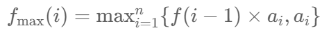
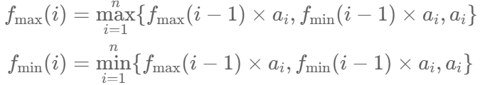

# 152. 乘积最大子数组

> [LeetCode 原题链接](https://leetcode.cn/problems/maximum-product-subarray/)

## 题目描述

给你一个整数数组 nums ，请你找出数组中乘积最大的非空连续 子数组（该子数组中至少包含一个数字），并返回该子数组所对应的乘积。

测试用例的答案是一个 32-位 整数。

请注意，一个只包含一个元素的数组的乘积是这个元素的值。

### 示例 1

```text
输入: nums = [2,3,-2,4]
输出: 6
解释: 子数组 [2,3] 有最大乘积 6。
```

### 示例 2

```text
输入: nums = [-2,0,-1]
输出: 0
解释: 结果不能为 2, 因为 [-2,-1] 不是子数组。
```

### 提示

- 1 <= nums.length <= 2 * 104
- -10 <= nums[i] <= 10
- nums 的任何子数组的乘积都 保证 是一个 32-位 整数

---

## 原文解题记录

**方法一：动态规划**

**思路和算法**

如果我们用 fmax(i) 开表示以第 i 个元素结尾的乘积最大子数组的乘积，a 表示输入参数 nums，那么根据「53. 最大子序和」的经验，我们很容易推导出这样的状态转移方程：

<p align="center"></p>

它表示以第i个元素结尾的乘积最大子数组的乘积可以考虑ai加入前面的fmax(i−1)对应的一段，或者单独成为一段，这里两种情况下取最大值。求出所有的fmax(i)之后选取最大的一个作为答案。

**可是在这里，这样做是错误的。为什么呢？**

因为这里的定义并不满足「最优子结构」。具体地讲，如果 a={5,6,−3,4,−3}，那么此时fmax对应的序列是 {5,30,−3,4,−3}，按照前面的算法我们可以得到答案为30，即前两个数的乘积，而实际上答案应该是全体数字的乘积。我们来想一想问题出在哪里呢？问题出在最后一个−3所对应的fmax的值既不是−3，也不是4×−3，而是5×30×(−3)×4×(−3)。所以我们得到了一个结论：**当前位置的最优解未必是由前一个位置的最优解转移得到的。**

**我们可以根据正负性进行分类讨论。**

考虑当前位置如果是一个负数的话，那么我们希望以它前一个位置结尾的某个段的积也是个负数，这样就可以负负得正，并且我们希望这个积尽可能「负得更多」，即尽可能小。如果当前位置是一个正数的话，我们更希望以它前一个位置结尾的某个段的积也是个正数，并且希望它尽可能地大。于是这里我们可以再维护一个fmin(i)，它表示以第i个元素结尾的乘积最小子数组的乘积，那么我们可以得到这样的动态规划转移方程：

<p align="center"></p>

它代表第i个元素结尾的乘积最大子数组的乘积fmax(i)，可以考虑把ai加入第i−1个元素结尾的乘积最大或最小的子数组的乘积中，二者加上ai，三者取大，就是第i个元素结尾的乘积最大子数组的乘积。第i个元素结尾的乘积最小子数组的乘积fmin(i)同理。

不难给出这样的实现：

```cpp
class Solution {

public:

int maxProduct(vector<int>& nums) {

vector <long> maxF(nums.begin(),nums.end()), minF(nums.begin(), nums.end());

for (int i = 1; i < nums.size(); ++i) {

maxF[i] = max(maxF[i - 1] * nums[i], max((long)nums[i], minF[i - 1] * nums[i]));

minF[i] = min(minF[i - 1] * nums[i], min((long)nums[i], maxF[i - 1] * nums[i]));

if(minF[i]<INT_MIN) {

minF[i]=nums[i];

}

}

return *max_element(maxF.begin(), maxF.end());

}

};
```

易得这里的渐进时间复杂度和渐进空间复杂度都是 O(n)。

**考虑优化空间。**

由于第 i 个状态只和第 i−1 个状态相关，根据「滚动数组」思想，我们可以只用两个变量来维护 i−1 时刻的状态，一个维护fmax，一个维护fmin。细节参见代码。

**代码**

```cpp
class Solution {

public:

int maxProduct(vector<int>& nums) {

long maxF = nums[0], minF = nums[0], ans = nums[0];

for (int i = 1; i < nums.size(); ++i) {

long mx = maxF, mn = minF;

maxF = max(mx * nums[i], max((long)nums[i], mn * nums[i]));

minF = min(mn * nums[i], min((long)nums[i], mx * nums[i]));

if(minF<INT_MIN) {

minF=nums[i];

}

ans = max(maxF, ans);

}

return ans;

}

};
```

**复杂度分析**

记nums元素个数为 n。

时间复杂度：程序一次循环遍历了nums，故渐进时间复杂度为O(n)。

空间复杂度：优化后只使用常数个临时变量作为辅助空间，与n无关，故渐进空间复杂度为O(1)。

**我的代码：**

```cpp
class Solution {

public:

int maxProduct(vector<int>& nums) {

vector<int> mmin(nums.size());

vector<int> mmax(nums.size());

mmin[0] = nums[0];

mmax[0] = nums[0];

int ans = nums[0];

for(int i = 1;i < nums.size();i ++)

{

if(nums[i] >= 0)

{

mmin[i] = min(mmin[i-1]*nums[i],nums[i]);

mmax[i] = max(mmax[i-1]*nums[i],nums[i]);

}

else{

mmin[i] = min(mmax[i-1]*nums[i],nums[i]);

mmax[i] = max(mmin[i-1]*nums[i],nums[i]);

}

ans = max(ans,mmax[i]);

}

return ans;

}

};
```

四个表达式的作用：

**正数分支：**

mmin[i] = min(mmin[i-1]*nums[i], nums[i]) — 当前数乘上前面的最小乘积，跟当前数自己比，取更小的作为新的最小乘积（因为正数会让最小值变得更小）

mmax[i] = max(mmax[i-1]*nums[i], nums[i]) — 当前数乘上前面的最大乘积，跟当前数自己比，取更大的作为新的最大乘积

**负数分支：**

mmin[i] = min(mmax[i-1]*nums[i], nums[i]) — 负数乘上之前的最大值，反而可能变成最小值，跟当前数自己比取更小的

mmax[i] = max(mmin[i-1]*nums[i], nums[i]) — 负数乘上之前的最小值，反而可能变成最大值，跟当前数自己比取更大的

**核心思想：维护两个状态，因为负数会把最大变最小、最小变最大，所以每次都要交换着用。**

拿 [-2, 3, -4] 举例：

**i=0：** mmax[0]=-2, mmin[0]=-2

**i=1，nums[1]=3（正数）：**

- mmax[1] = max(-2 * 3, 3) = max(-6, 3) = 3

- mmin[1] = min(-2 * 3, 3) = min(-6, 3) = -6

含义：到当前位置，最大乘积是3（单独取3），最小乘积是-6（-2 * 3）

**i=2，nums[2]=-4（负数）：**

- mmax[2] = max(mmin[1]*(-4), -4) = max((-6)*(-4), -4) = max(24, -4) = 24

- mmin[2] = min(mmax[1]*(-4), -4) = min(3*(-4), -4) = min(-12, -4) = -12

关键：负数让之前的最小(-6)变成了最大(24)，之前的最大(3)变成了最小(-12)

最终答案是24，即整个数组 [-2]*3*(-4)=24。

这就是为什么负数时要交换着用——负负得正，最小乘负数变最大。
