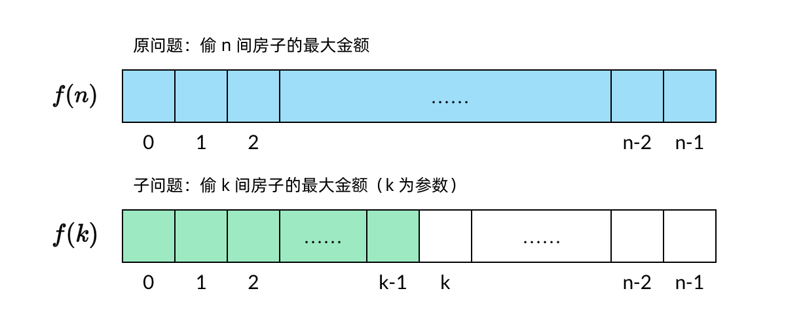
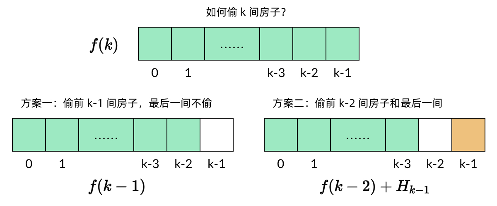
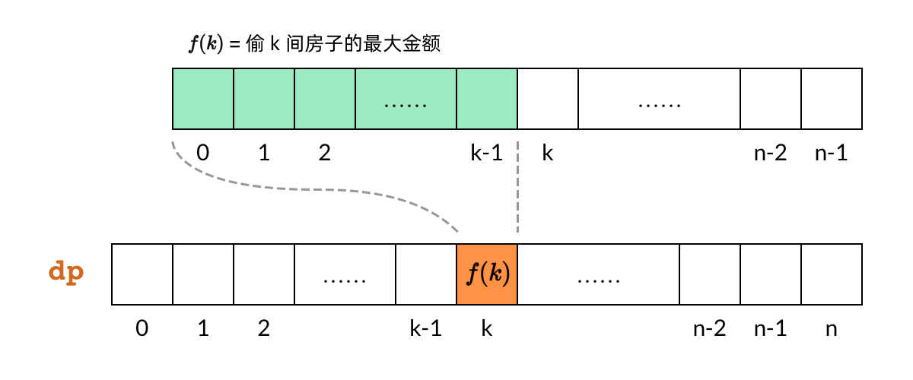
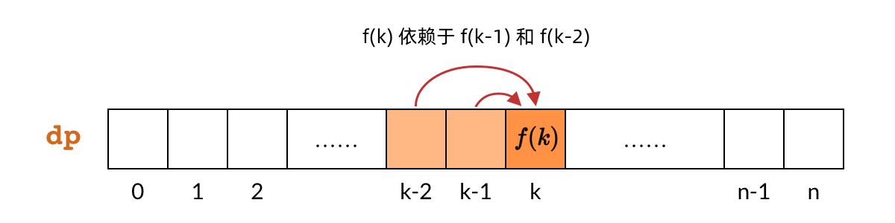
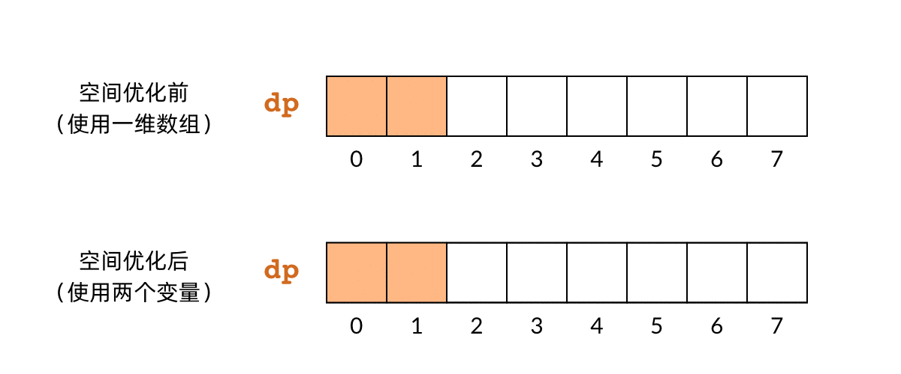

# 198. 打家劫舍

> [LeetCode 原题链接](https://leetcode.cn/problems/house-robber/)

## 题目描述

你是一个专业的小偷，计划偷窃沿街的房屋。每间房内都藏有一定的现金，影响你偷窃的唯一制约因素就是相邻的房屋装有相互连通的防盗系统，如果两间相邻的房屋在同一晚上被小偷闯入，系统会自动报警。

给定一个代表每个房屋存放金额的非负整数数组，计算你 不触动警报装置的情况下 ，一夜之内能够偷窃到的最高金额。

### 示例 1

```text
输入：[1,2,3,1]
输出：4
解释：偷窃 1 号房屋 (金额 = 1) ，然后偷窃 3 号房屋 (金额 = 3)。
     偷窃到的最高金额 = 1 + 3 = 4 。
```

### 示例 2

```text
输入：[2,7,9,3,1]
输出：12
解释：偷窃 1 号房屋 (金额 = 2), 偷窃 3 号房屋 (金额 = 9)，接着偷窃 5 号房屋 (金额 = 1)。
     偷窃到的最高金额 = 2 + 9 + 1 = 12 。
```

### 提示

- 1 <= nums.length <= 100
- 0 <= nums[i] <= 400

---

## 原文解题记录

**解题思路：**

如果你对于动态规划还不是很了解，或者没怎么做过动态规划的题目的话，那么House Robber（小偷问题）这道题是一个非常好的入门题目。本文会以House Robber题目为例子，讲解动态规划题目的四个基本步骤。

动态规划的的四个解题步骤是：

- 定义子问题

- 写出子问题的递推关系

- 确定DP数组的计算顺序

- 空间优化（可选）

下面我们一步一步地进行讲解。

**步骤****一****：定义子问题**

稍微接触过一点动态规划的朋友都知道动态规划有一个“子问题”的定义。什么是子问题？子问题是和原问题相似，但规模较小的问题。例如这道小偷问题，原问题是“从全部房子中能偷到的最大金额”，将问题的规模缩小，子问题就是“**从k****个****房子中能偷到的最大金额**”，用f(k)表示。

<p align="center"></p>

可以看到，子问题是参数化的，我们定义的子问题中有参数k。假设一共有n个房子的话，就一共有n个子问题。动态规划实际上就是通过求这一堆子问题的解，来求出原问题的解。这要求子问题需要具备两个性质：

- 原问题要能由子问题表示。例如这道小偷问题中，k=n时实际上就是原问题。否则，解了半天子问题还是解不出原问题，那子问题岂不是白解了。

- 一个子问题的解要能通过其他子问题的解求出。例如这道小偷问题中，f(k)可以由f(k−1)和f(k−2)求出，具体原理后面会解释。这个性质就是教科书中所说的**“最优子结构”**。如果定义不出这样的子问题，那么这道题实际上没法用动态规划解。

小偷问题由于比较简单，定义子问题实际上是很直观的。一些比较难的动态规划题目可能需要一些定义子问题的技巧。

**步骤二：写出子问题的递推关系**

这一步是求解动态规划问题最关键的一步。然而，这一步也是最无法在代码中体现出来的一步。在做题的时候，最好把这一步的思路用注释的形式写下来。做动态规划题目不要求快，而要确保无误。否则，写代码五分钟，找bug半小时，岂不美哉？

我们来分析一下这道小偷问题的递推关系：

假设一共有n个房子，每个房子的金额分别是H0,H1,…,Hn−1，子问题f(k)表示从前k个房子（即H0,H1,…,Hk−1）中能偷到的最大金额。那么，偷k个房子有两种偷法：

<p align="center"></p>

k个房子中最后一个房子是Hk−1。如果不偷这个房子，那么问题就变成在前k−1个房子中偷到最大的金额，也就是子问题 f(k−1)。如果偷这个房子，那么前一个房子Hk−2显然不能偷，其他房子不受影响。那么问题就变成在前k−2个房子中偷到的最大的金额。两种情况中，选择金额较大的一种结果。

f(k)=max{f(k−1),Hk−1+f(k−2)}

**当前房间为****nums****[i-1]，前****i****间房间能****偷金额****最大值为****dp****[****i****]**

- 当不偷当前房间时，偷前i-1间房间--dp[i-1]

- 当偷当前房间时，隔壁那一间不能偷，得偷i-2之前的之前的--dp[i-2]

在写递推关系的时候，要注意写上 k=0 和 k=1 的基本情况：

- 当 k=0 时，没有房子，所以f(0)=0。

- 当 k=1 时，只有一个房子，偷这个房子即可，所以f(1)=H0

这样才能构成完整的递推关系，后面写代码也不容易在边界条件上出错。

**敲黑板！****！！**

**dp****[****i****] 表示****前****i****个****房屋（即下标0到i-1）能偷到的最大金额。**

**nums**** 下标从0开始，****dp****下标从1开始对应第1个房屋，所以****dp****[****i****]对应的是****nums****[i-1]。**

**也就是没有****nums****[****i****]，****当前房间为****nums****[i-1]，****nums****[****i****](不存在)，****nums****中只有[0,i-1]****个****空间**

评论区：

这里步骤二直接说“偷k个房子有两种偷法”是不准确的，首先应该是f(k) = max(f(k-1) , max( f(0), f(1), f(2), ... f(k-2)) + nums[i])。我的意思是，偷房子不一定就是隔着一间房子去偷，假如[4, 2, 3, 12]。偷4和12是利润最大的。当然这里f(k)的含义是偷k间房子的最大利润，k从0开始迭代，很容易证明f(k) >= f(k-1)，所以上面的式子变为f(k) = max( f(k-1), f(k-2) + nums[i] )。

f(k) = max( f(k-1), f(k-2) + nums[i] ), f[k]的意义是 前i个 房子中能偷到的最大金额，前3个的方案肯定包括了前2个；而 f(k) = max(f(k-1) , max( f(0), f(1), f(2), ... f(k-2)) + nums[i]) ,f[k] 的意思更倾向于: **选择第k****个****房子的话，所能达到的最大值。**

这个解法的含义就是，你当前位于K的房子，你可以选择：1、偷 2、不偷。第一种方案不能偷k-1的房子，所以f(k)=H(k-1)+f(k-2)；第二种方案可以偷前(k-1)个房子中的任意房子，所以f(k)=f(k-1)，最终小偷在两种方案中做权衡，f(k)=max(H(k-1)+f(k-2),f(k-1))

**步骤三：确定DP数组的计算顺序**

在确定了子问题的递推关系之后，下一步就是依次计算出这些子问题了。在很多教程中都会写，动态规划有两种计算顺序，一种是自顶向下的、使用备忘录的递归方法，一种是自底向上的、使用dp 数组的循环方法。不过**在普通的动态规划题目中，99%的情况我们都不需要用到备忘录方法**，所以我们最好坚持用自底向上的dp数组。

DP数组也可以叫“子问题数组”，因为DP数组中的每一个元素都对应一个子问题。如下图所示，dp[k]对应子问题f(k)，即偷前k间房子的最大金额。

<p align="center"></p>

那么，只要搞清楚了子问题的计算顺序，就可以确定DP数组的计算顺序。对于小偷问题，我们分析子问题的依赖关系，发现每个f(k)依赖f(k−1)和f(k−2)。也就是说，dp[k]依赖dp[k-1]和dp[k-2]，如下图所示。

<p align="center"></p>

那么，既然DP数组中的依赖关系都是向右指的，DP数组的计算顺序就是从左向右。这样我们可以保证，计算一个子问题的时候，它所依赖的那些子问题已经计算出来了。

确定了 DP 数组的计算顺序之后，我们就可以写出题解代码了：

int rob(vector<int>& nums) {

if (nums.size() == 0) {

return 0;

}

// 子问题：

// f(k) = 偷 [0..k) 房间中的最大金额

// f(0) = 0

// f(1) = nums[0]

// f(k) = max{ rob(k-1), nums[k-1] + rob(k-2) }

int N = nums.size();

vector<int> dp(N+1, 0);

dp[0] = 0;

dp[1] = nums[0];

for (int k = 2; k <= N; k++) {

dp[k] = max(dp[k-1], nums[k-1] + dp[k-2]);

}

return dp[N];

}

**步骤四：空间优化**

空间优化是动态规划问题的进阶内容了。对于初学者来说，可以不掌握这部分内容。

空间优化的基本原理是，很多时候我们并不需要始终持有全部的DP数组。对于小偷问题，我们发现，最后一步计算f(n)的时候，实际上只用到了f(n−1)和f(n−2)的结果。n−3之前的子问题，实际上早就已经用不到了。那么，我们可以只用两个变量保存两个子问题的结果，就可以依次计算出所有的子问题。下面的动图比较了空间优化前和优化后的对比关系：

<p align="center"></p>

这样一来，空间复杂度也从O(n)降到了O(1)。优化后的代码如下所示：

int rob(vector<int>& nums) {

int prev = 0;

int curr = 0;

// 每次循环，计算“偷到当前房子为止的最大金额”

for (int i : nums) {

// 循环开始时，curr 表示 dp[k-1]，prev 表示 dp[k-2]

// dp[k] = max{ dp[k-1], dp[k-2] + i }

int temp = max(curr, prev + i);

prev = curr;

curr = temp;

// 循环结束时，curr 表示 dp[k]，prev 表示 dp[k-1]

}

return curr;

}
