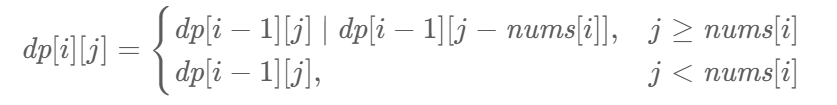

# 416. 分割等和子集

> [LeetCode 原题链接](https://leetcode.cn/problems/partition-equal-subset-sum/)

## 题目描述

给你一个 只包含正整数 的 非空 数组 nums 。请你判断是否可以将这个数组分割成两个子集，使得两个子集的元素和相等。

### 示例 1

```text
输入：nums = [1,5,11,5]
输出：true
解释：数组可以分割成 [1, 5, 5] 和 [11] 。
```

### 示例 2

```text
输入：nums = [1,2,3,5]
输出：false
解释：数组不能分割成两个元素和相等的子集。
```

### 提示

- 1 <= nums.length <= 200
- 1 <= nums[i] <= 100

---

## 原文解题记录

现在积累的一个大概思路：如果是子序列，就考虑使用01背包。如果是连续子序列的，就考虑前后累加。这个思路待以后刷题数量增加而丰富

本题是经典的「NP完全问题」，也就是说，如果你发现了该问题的一个多项式算法，那么恭喜你证明出了P=NP，可以期待一下图灵奖了。

正因如此，我们不应期望该问题有多项式时间复杂度的解法。我们能想到的，例如基于贪心算法的「将数组降序排序后，依次将每个元素添加至当前元素和较小的子集中」之类的方法都是错误的，可以轻松地举出反例。因此，我们必须尝试非多项式时间复杂度的算法，例如时间复杂度与元素大小相关的动态规划。

**方法一：动态规划**

**思路与算法**

这道题可以换一种表述：给定一个只包含正整数的非空数组 nums[0]，判断是否可以从数组中选出一些数字，使得这些数字的和等于整个数组的元素和的一半。因此这个问题可以转换成「0−1背包问题」。

这道题与传统的「0−1背包问题」的区别在于，传统的「0−1背包问题」要求选取的物品的重量之和不能超过背包的总容量，这道题则要求选取的数字的和恰好等于整个数组的元素和的一半。类似于传统的「0−1背包问题」，可以使用动态规划求解。

在使用动态规划求解之前，首先需要进行以下判断。

- 根据数组的长度n判断数组是否可以被划分。如果n<2，则不可能将数组分割成元素和相等的两个子集，因此直接返回false。

- 计算整个数组的元素和sum以及最大元素maxNum。如果sum是奇数，则不可能将数组分割成元素和相等的两个子集，因此直接返回false。如果sum是偶数，则令target = sum/2，需要判断是否可以从数组中选出一些数字，使得这些数字的和等于target。如果 maxNum>target，则除了maxNum以外的所有元素之和一定小于target，因此不可能将数组分割成元素和相等的两个子集，直接返回false。

创建二维数组dp，包含n行target+1列，**其中****dp****[****i****][j]表示从数组的[0,i]下标范围内选取若干个正整数（可以是0个），是否存在一种选取方案使得被选取的正整数的和等于j。**初始时，dp中的全部元素都是false。

在定义状态之后，需要考虑边界情况。以下两种情况都属于边界情况。

- 如果不选取任何正整数，则被选取的正整数之和等于0。因此对于所有0≤i<n，都有 dp[i][0]=true。

- 当i==0时，只有一个正整数nums[0]可以被选取，因此dp[0][nums[0]]=true。

对于 i>0 且 j>0 的情况，如何确定 dp[i][j] 的值？需要分别考虑以下两种情况。

- 如果 j≥nums[i]，则对于当前的数字 nums[i]，可以选取也可以不选取，两种情况只要有一个为 true，就有 dp[i][j]=true。

- 如果不选取 nums[i]，则 dp[i][j]=dp[i−1][j]；

- 如果选取 nums[i]，则 dp[i][j]=dp[i−1][j−nums[i]]。

- 如果 j<nums[i]，则在选取的数字的和等于 j 的情况下无法选取当前的数字 nums[i]，因此有 dp[i][j]=dp[i−1][j]。

状态转移方程如下：

<p align="center"></p>

最终得到 dp[n−1][target] 即为答案。

class Solution {

public:

bool canPartition(vector<int>& nums) {

int n = nums.size();

if (n < 2) {

return false;

}

int sum = accumulate(nums.begin(), nums.end(), 0);

int maxNum = *max_element(nums.begin(), nums.end());

if (sum & 1) {

return false;

}

int target = sum / 2;

if (maxNum > target) {

return false;

}

vector<vector<int>> dp(n, vector<int>(target + 1, 0));

for (int i = 0; i < n; i++) {

dp[i][0] = true;

}

dp[0][nums[0]] = true;

for (int i = 1; i < n; i++) {

int num = nums[i];

for (int j = 1; j <= target; j++) {

if (j >= num) {

dp[i][j] = dp[i - 1][j] | dp[i - 1][j - num];

} else {

dp[i][j] = dp[i - 1][j];

}

}

}

return dp[n - 1][target];

}

};

上述代码的空间复杂度是O(n×target)。但是可以发现在计算dp的过程中，每一行的dp值都只与上一行的dp值有关，因此只需要一个一维数组即可将空间复杂度降到O(target)。

此时的转移方程为：

dp[j]=dp[j] ∣ dp[j−nums[i]]

且需要注意的是第二层的循环我们需要从大到小计算，因为如果我们从小到大更新dp值，那么在计算dp[j]值的时候，dp[j−nums[i]]已经是被更新过的状态，不再是上一行的dp值。

**代码**

class Solution {

public:

bool canPartition(vector<int>& nums) {

int n = nums.size();

if (n < 2) {

return false;

}

int sum = 0, maxNum = 0;

for (auto& num : nums) {

sum += num;

maxNum = max(maxNum, num);

}

if (sum & 1) {

return false;

}

int target = sum / 2;

if (maxNum > target) {

return false;

}

vector<int> dp(target + 1, 0);

dp[0] = true;

for (int i = 0; i < n; i++) {

int num = nums[i];

for (int j = target; j >= num; --j) {

dp[j] |= dp[j - num];

}

}

return dp[target];

}

};

**复杂度分析**

时间复杂度：O(n×target)，其中 n 是数组的长度，target 是整个数组的元素和的一半。需要计算出所有的状态，每个状态在进行转移时的时间复杂度为 O(1)。

空间复杂度：O(target)，其中 target 是整个数组的元素和的一半。空间复杂度取决于 dp 数组，在不进行空间优化的情况下，空间复杂度是 O(n×target)，在进行空间优化的情况下，空间复杂度可以降到 O(target)。

class Solution {

public:

bool canPartition(vector<int>& nums) {

int n=nums.size(),sum=0;

for(int i=0;i<nums.size();i++){

sum+=nums[i];

}

if(sum%2) return false;

int target = sum/2;

vector<int> ans(target+1);

for(int i=0;i<n;i++){

for(int j=target;j>=nums[i];j--){

ans[j]=max(ans[j],ans[j-nums[i]]+nums[i]);

}

}

return ans[target]==target?true:false;

}

};

class Solution {

public:

bool canPartition(vector<int>& nums) {

int sum = accumulate(nums.begin(),nums.end(),0);

vector <int> dp(sum/2 + 1);

dp[0] = 1;

if((sum & 1)) return false;

for(auto x : nums){

for(int j = sum/2;j >= x;j -- ){

dp[j] |= dp[j - x];

}

}

if(!(sum & 1) && dp[sum/2]){

return true;

}

return false;

}

};

class Solution {

public:

bool canPartition(vector<int>& nums) {

int sum = 0;

for(auto num : nums) sum+=num;

if(sum % 2) return false;

int target = sum / 2;

vector<int> dp(target+1, 0);

dp[0] = 1;

for(auto num : nums){

for(int i = target; i >= num; i--){

dp[i] |= dp[i-num];

}

}

return dp[target];

}

};

class Solution {

public:

bool canPartition(vector<int>& nums) {

int sum=0;

// 求总和

for(int x:nums)

{

sum+=x;

}

// 总和为奇数，不可能平分

if(sum%2!=0)

return false;

int target=sum/2;

// dp[j]表示是否能组成j

vector<bool> dp(target+1,false);

// 什么都不选，可以组成0

dp[0]=true;

// 遍历每个数字,一个一个拿数组里的元素来尝试加入背包。

for(int num:nums)

{

// 注意：倒序！！！

for(int j=target;j>=num;j--)

{

// 选择num

dp[j]=dp[j] || dp[j-num];

}

}

return dp[target];

}

};

class Solution {

public:

bool canPartition(vector<int>& nums) {

int sum = 0;

for(auto num : nums) {

sum += num;

}

if(sum%2)

return false;

int target = sum/2;

vector<int> dp(target + 1,0);

for(auto num : nums) {

for(int i = target; i > 0; i--) {

if(i - num >=0 )

dp[i] = max(dp[i], dp[i - num] + num);

}

}

return dp[target] == target;

}

};
