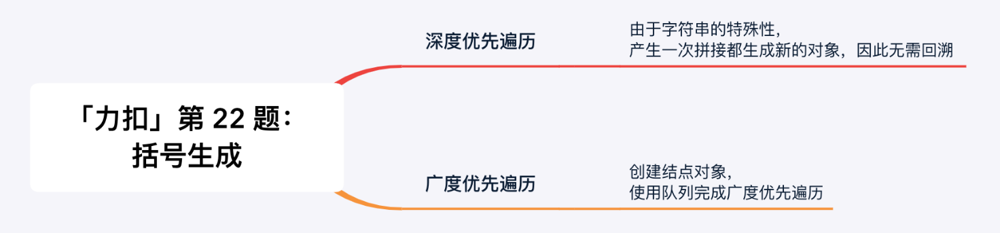
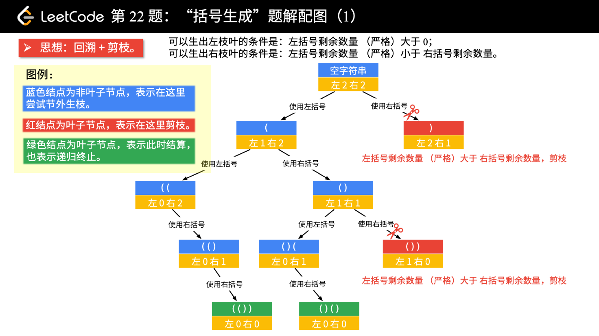
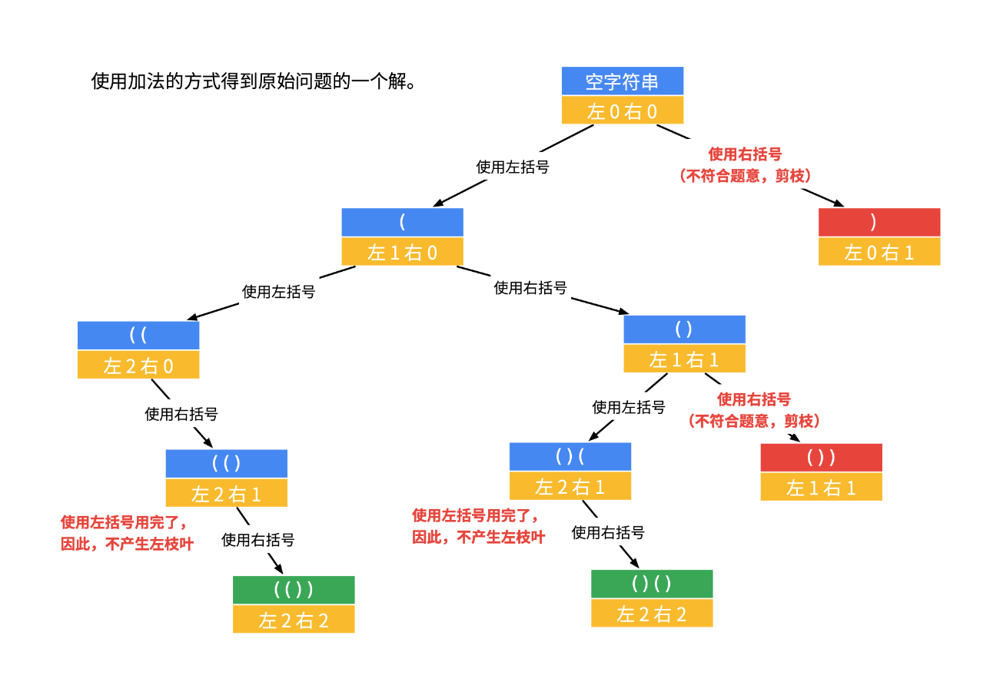

# 22. 括号生成

> [LeetCode 原题链接](https://leetcode.cn/problems/generate-parentheses/)

## 题目描述

数字 n 代表生成括号的对数，请你设计一个函数，用于能够生成所有可能的并且 有效的 括号组合。

### 示例 1

```text
输入：n = 3
输出：["((()))","(()())","(())()","()(())","()()()"]
```

### 示例 2

```text
输入：n = 1
输出：["()"]
```

### 提示

- 1 <= n <= 8

---

## 原文解题记录

<p align="center"></p>

这一类问题是在一棵隐式的树上求解，可以用深度优先遍历，也可以用广度优先遍历。

一般用深度优先遍历。原因是：

- 代码好写，使用递归的方法，直接借助**系统栈**完成状态的转移；

- 广度优先遍历得自己编写结点类和借助队列。

这里的「状态」是指程序执行到**隐式树**的某个结点的语言描述，在程序中用不同的**变量**加以区分。

**方法一：深度优先遍历**

我们以n = 2为例，画树形结构图。方法是「做减法」。

<p align="center"></p>

画图以后，可以分析出的结论：

- 当前左右括号都有大于 0 个可以使用的时候，才产生分支；

- 产生左分支的时候，只看当前是否还有左括号可以使用；

- 产生右分支的时候，还受到左分支的限制，右边剩余可以使用的括号数量一定得在严格大于左边剩余的数量的时候，才可以产生分支；

- 在左边和右边剩余的括号数都等于0的时候结算。

我们运行n = 2的情况，得到结果[(()), ()()]，说明分析的结果是正确的。

**一共分两种情况即可，其中一种里再分两种情况但可以同时满足**

如果我们不用减法，使用加法，即left表示「左括号使用了几个」，right表示「右括号使用了几个」，可以画出另一棵递归树。

<p align="center"></p>

看不懂官方题解，这个题有这么复杂吗？有规律啊，**剩余左括号总数要小于等于右括号。**

递归把所有符合要求的加上去就行了：

class Solution {

List<String> res = new ArrayList<>();

public List<String> generateParenthesis(int n) {

if(n <= 0){

return res;

}

getParenthesis("",n,n);

return res;

}

private void getParenthesis(String str,int left, int right) {

if(left == 0 && right == 0 ){

res.add(str);

return;

}

if(left == right){

//剩余左右括号数相等，下一个只能用左括号

getParenthesis(str+"(",left-1,right);

}else if(left < right){

//剩余左括号小于右括号，下一个可以用左括号也可以用右括号

if(left > 0){

getParenthesis(str+"(",left-1,right);

}

getParenthesis(str+")",left,right-1);

}

}

}

**代码**

**一：****减法**

class Solution {

public:

vector<string> res;

vector<string> generateParenthesis(int n) {

backtrack("",n,n);

return res;

}

void backtrack(string cur,int left,int right)

{

if(!left && !right)

{

res.push_back(cur);

return;

}

if(left == right)

{

backtrack(cur+"(",left - 1,right);

}

else if(left < right)

{

if(left > 0) backtrack(cur+"(",left - 1,right);

backtrack(cur+")",left,right - 1);

}

}

};

**二：****加法**

class Solution {

public:

vector<string> res;

string cur;

vector<string> generateParenthesis(int n) {

backtrack(cur,0,0,n);

return res;

}

void backtrack(string& cur,int left,int right,int sum)

{

if(left == sum && right == sum)

{

res.push_back(cur);

return;

}

if(left == right)

{

cur.push_back('(');

backtrack(cur,left + 1,right,sum);

cur.pop_back();

}

else if(left > right)

{

if(left < sum)

{

cur.push_back('(');

backtrack(cur,left + 1,right,sum);

cur.pop_back();

}

cur.push_back(')');

backtrack(cur,left,right + 1,sum);

cur.pop_back();

}

}

};

**代码注意事项**

- **区分传值和传引用**：传值时用cur + '('，新字符串自动创建，无需手动恢复；传引用时用push_back/pop_back手动恢复现场

- **push_back****返回void**：cur.push_back('(')返回void，不能作为backtrack的第一个参数，这个**push_back**不能写在backtrack()函数参数里,必须先push再单独调用函数。传值更简洁但效率略低，引用+pop_back效率更高。

| backtrack(cur.push_back('('), left + 1, right, sum);<br>cur.pop_back(); |
| --- |
| cur.push_back('(');<br>backtrack(cur, left + 1, right, sum);<br>cur.pop_back(); |

- **成员变量 vs 局部变量**：如果在类内定义了成员变量 res 和 cur，递归函数可以直接访问；如果是局部变量，需要作为参数传递

- **终止条件**：用递减计数时写 !left && !right，用递增计数时写 left == n && right == n，保持一致即可

- **剪枝条件**：left < right时才能加右括号，left < n时才能加左括号

**方法二：广度优先遍历**

通过编写广度优先遍历的代码，读者可以体会一下，为什么搜索几乎都是用深度优先遍历（回溯算法）。

广度优先遍历，得程序员自己编写结点类，显示使用队列这个数据结构。深度优先遍历的时候，就可以直接使用系统栈，在递归方法执行完成的时候，系统栈顶就把我们所需要的状态信息直接弹出，而无须编写结点类和显示使用栈。

下面的代码，读者可以把Queue换成Stack，提交以后，也可以得到Accept。

读者可以通过比较：

- 广度优先遍历；

- 自己使用栈编写深度优先遍历；

- 使用系统栈的深度优先遍历（回溯算法）。

来理解「回溯算法」作为一种「搜索算法」的合理性。

还是上面的题解配图（1），使用广度优先遍历，结果集都在最后一层，即叶子结点处得到所有的结果集。
