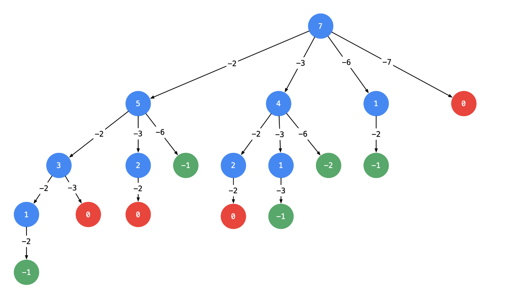
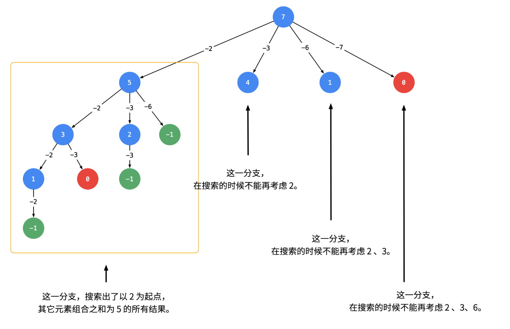
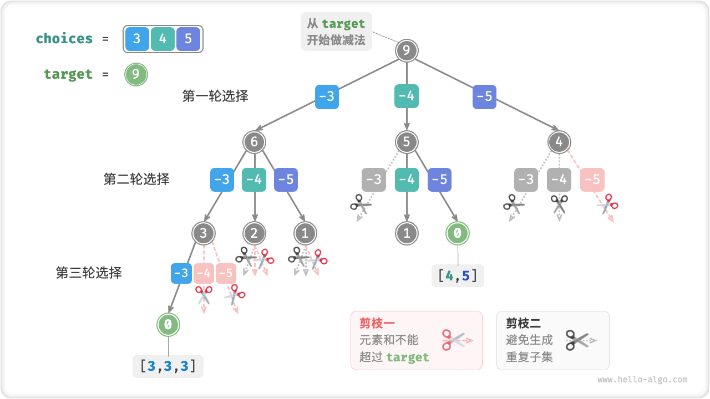
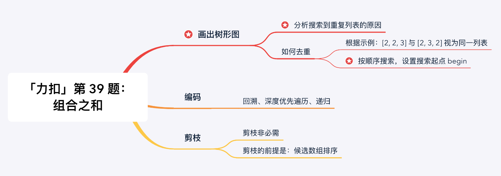

# 39. 组合总和

> [LeetCode 原题链接](https://leetcode.cn/problems/combination-sum/)

## 题目描述

给你一个 无重复元素 的整数数组 candidates 和一个目标整数 target ，找出 candidates 中可以使数字和为目标数 target 的 所有 不同组合 ，并以列表形式返回。你可以按 任意顺序 返回这些组合。

candidates 中的 同一个 数字可以 无限制重复被选取 。如果至少一个数字的被选数量不同，则两种组合是不同的。

对于给定的输入，保证和为 target 的不同组合数少于 150 个。

### 示例 1

```text
输入：candidates = [2,3,6,7], target = 7
输出：[[2,2,3],[7]]
解释：
2 和 3 可以形成一组候选，2 + 2 + 3 = 7 。注意 2 可以使用多次。
7 也是一个候选， 7 = 7 。
仅有这两种组合。
```

### 示例 2

```text
输入: candidates = [2,3,5], target = 8
输出: [[2,2,2,2],[2,3,3],[3,5]]
```

### 示例 3

```text
输入: candidates = [2], target = 1
输出: []
```

### 提示

- 1 <= candidates.length <= 30
- 2 <= candidates[i] <= 40
- candidates 的所有元素 互不相同
- 1 <= target <= 40

---

## 原文解题记录

**回溯法总结：**

1）当组合中允许元素重复：则迭代的起始值就是i，每次递增

2）当组合中不允许重复：迭代的起始值是i + 1，每次递增

3）当这是排列不是组合：迭代的起始值是传进去的start（初始位），每次都从头开始遍历所有元素

**方法****一****：回溯算法+剪枝**

**思路分析**

根据示例1：输入: candidates = [2, 3, 6, 7]，target = 7。

- 候选数组里有 2，如果找到了组合总和为7 - 2 = 5的所有组合，再在之前加上2，就是7的所有组合；

- 同理考虑 3，如果找到了组合总和为7 - 3 = 4的所有组合，再在之前加上3，就是7的所有组合，依次这样找下去。

基于以上的想法，可以画出如下的树形图。建议自己在纸上画出这棵树，**这一类问题都需要先画出树形图，然后编码实现。**

编码通过**深度优先遍历**实现，使用一个列表，在深度优先遍历变化的过程中，遍历所有可能的列表并判断当前列表是否符合题目的要求，成为「回溯算法」（个人理解，非形式化定义）。

**画出树形图**

以下给出的是一种树形图的画法。对于组合来说，还可以根据一个数选和不选画树形图。

以输入：candidates = [2, 3, 6, 7], target =7为例：

<p align="center"></p>

**说明：**

- 以target = 7为**根结点**，创建一个分支的时**做减法**；

- 每一个箭头表示：从父亲结点的数值减去边上的数值，得到孩子结点的数值。边的值就是题目中给出的candidate数组的每个元素的值；

- 减到0或者负数的时候停止，即：结点0和负数结点成为叶子结点；

- 所有从根结点到结点0的路径（只能从上往下，没有回路）就是题目要找的一个结果。

这棵树有4个叶子结点的值0，对应的路径列表是[[2, 2, 3], [2, 3, 2], [3, 2, 2], [7]]，而示例中给出的输出只有 [[7], [2, 2, 3]]。即：题目中要求每一个符合要求的解是**不计算顺序**的。下面我们分析为什么会产生重复。

**针对具体例子分析重复路径产生的原因（难点）**

提示：这一部分描述有些晦涩难懂，建议先自己观察出现重复的原因，进而思考如何解决。

产生重复的原因是：在每一个结点，做减法，展开分支的时候，由于题目中说**每一个元素可以重复使用**，我们考虑了**所有的**候选数，因此出现了重复的列表。

一种简单的去重方案是借助**哈希表**的天然去重的功能，但实际操作一下，就会发现并没有那么容易。

可不可以在搜索的时候就去重呢？答案是可以的。遇到这一类相同元素不计算顺序的问题，我们在搜索的时候就需要**按某种顺序搜索**。具体的做法是：每一次搜索的时候设置**下一轮搜索的起点**begin，请看下图。

<p align="center"></p>

即：从每一层的第 2 个结点开始，都不能再搜索产生同一层结点已经使用过的 candidate 里的元素。

提示：如果题目要求，结果集不计算顺序，此时需要按顺序搜索，才能做到不重不漏。「力扣」第47题（全排列 II）、「力扣」第15题（三数之和）也使用了类似的思想，使得结果集没有重复。

**复杂度分析：**

时间复杂度与candidate数组的值有关：

如果candidate数组的值都很大，target的值很小，那么树上的结点就比较少；

如果candidate数组的值都很小，target的值很大，那么树上的结点就比较多。

所以时间复杂度与空间复杂度不确定。

**剪枝提速**

- 根据上面画树形图的经验，如果 target 减去一个数得到负数，那么减去一个更大的树依然是负数，同样搜索不到结果。基于这个想法，我们可以对输入数组进行排序，添加相关逻辑达到进一步剪枝的目的；

- 排序是为了提高搜索速度，对于解决这个问题来说非必要。但是搜索问题一般复杂度较高，能剪枝就尽量剪枝。实际工作中如果遇到两种方案拿捏不准的情况，都试一下。

<p align="center"></p>

**总结**

<p align="center"></p>

**什么时候使用used数组，什么时候使用begin变量**

- 排列问题，讲究顺序（即[2, 2, 3]与[2, 3, 2]视为不同列表时），需要记录哪些数字已经使用过，此时用used数组；

- 组合问题，不讲究顺序（即[2, 2, 3]与[2, 3, 2]视为相同列表时），需要按照某种顺序搜索，此时使用begin变量。

注意：具体问题应该具体分析，**理解算法的设计思想**是至关重要的，请不要死记硬背。

**补充说明**

如果对于「回溯算法」的理解还很模糊的朋友，建议在「递归」之前和「递归」之后，把path变量的值打印出来看一下，以加深对于程序执行流程的理解。

**回溯打印输出：**

递归之前 => [2]，剩余 = 5

递归之前 => [2, 2]，剩余 = 3

递归之前 => [2, 2, 2]，剩余 = 1

递归之前 => [2, 2, 2, 2]，剩余 = -1

递归之后 => [2, 2, 2]

递归之前 => [2, 2, 2, 3]，剩余 = -2

递归之后 => [2, 2, 2]

递归之前 => [2, 2, 2, 6]，剩余 = -5

递归之后 => [2, 2, 2]

递归之前 => [2, 2, 2, 7]，剩余 = -6

递归之后 => [2, 2, 2]

递归之后 => [2, 2]

递归之前 => [2, 2, 3]，剩余 = 0

递归之后 => [2, 2]

递归之前 => [2, 2, 6]，剩余 = -3

递归之后 => [2, 2]

递归之前 => [2, 2, 7]，剩余 = -4

递归之后 => [2, 2]

递归之后 => [2]

递归之前 => [2, 3]，剩余 = 2

递归之前 => [2, 3, 3]，剩余 = -1

递归之后 => [2, 3]

递归之前 => [2, 3, 6]，剩余 = -4

递归之后 => [2, 3]

递归之前 => [2, 3, 7]，剩余 = -5

递归之后 => [2, 3]

递归之后 => [2]

递归之前 => [2, 6]，剩余 = -1

递归之后 => [2]

递归之前 => [2, 7]，剩余 = -2

递归之后 => [2]

递归之后 => []

递归之前 => [3]，剩余 = 4

递归之前 => [3, 3]，剩余 = 1

递归之前 => [3, 3, 3]，剩余 = -2

递归之后 => [3, 3]

递归之前 => [3, 3, 6]，剩余 = -5

递归之后 => [3, 3]

递归之前 => [3, 3, 7]，剩余 = -6

递归之后 => [3, 3]

递归之后 => [3]

递归之前 => [3, 6]，剩余 = -2

递归之后 => [3]

递归之前 => [3, 7]，剩余 = -3

递归之后 => [3]

递归之后 => []

递归之前 => [6]，剩余 = 1

递归之前 => [6, 6]，剩余 = -5

递归之后 => [6]

递归之前 => [6, 7]，剩余 = -6

递归之后 => [6]

递归之后 => []

递归之前 => [7]，剩余 = 0

递归之后 => []

输出 => [[2, 2, 3], [7]]

**剪枝提速打印输出：**

递归之前 => [2]，剩余 = 5

递归之前 => [2, 2]，剩余 = 3

递归之前 => [2, 2, 2]，剩余 = 1

递归之后 => [2, 2]

递归之前 => [2, 2, 3]，剩余 = 0

递归之后 => [2, 2]

递归之后 => [2]

递归之前 => [2, 3]，剩余 = 2

递归之后 => [2]

递归之后 => []

递归之前 => [3]，剩余 = 4

递归之前 => [3, 3]，剩余 = 1

递归之后 => [3]

递归之后 => []

递归之前 => [6]，剩余 = 1

递归之后 => []

递归之前 => [7]，剩余 = 0

递归之后 => []

输出 => [[2, 2, 3], [7]]

可以很清楚地看到有**「剪枝」**的代码考虑的路径数会更少一些。

**代码**

class Solution {

public:

vector<vector<int>> res;

vector<int> state;

vector<vector<int>> combinationSum(vector<int>& candidates, int target) {

int cur = 0;

sort(candidates.begin(),candidates.end()); ////记得排序

backtrack(state,target,cur,res,candidates);

return res;

}

void backtrack(vector<int>& state,int target,int cur,vector<vector<int>>& res,vector<int>& candidates)

{

if(target == 0)

{

res.push_back(state);

return;

}

for(int i = cur;i < candidates.size();i ++)

{

if(target - candidates[i] < 0) break;

state.push_back(candidates[i]);

backtrack(state,target - candidates[i],i,res,candidates);

state.pop_back();

}

}

};

**感觉跟****上一题****的****搜索****回溯问题****很像****hhh****，可以自己画图****写****一下**
