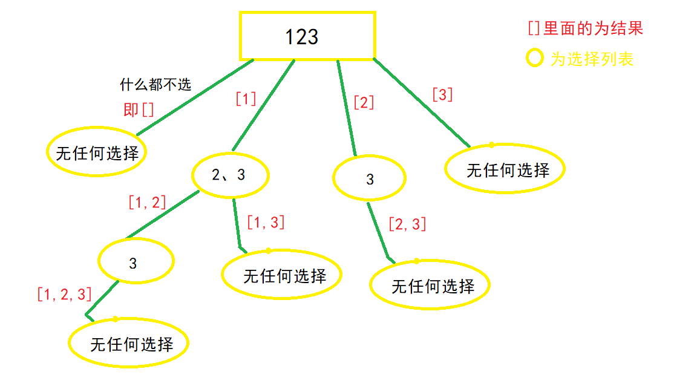
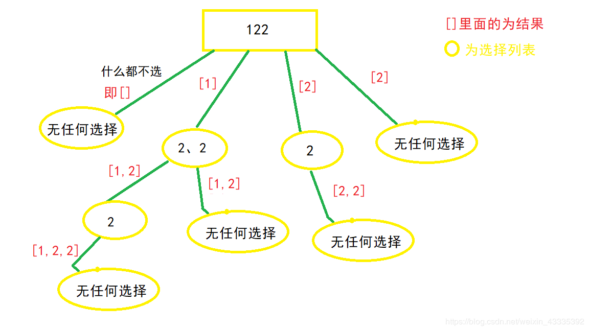
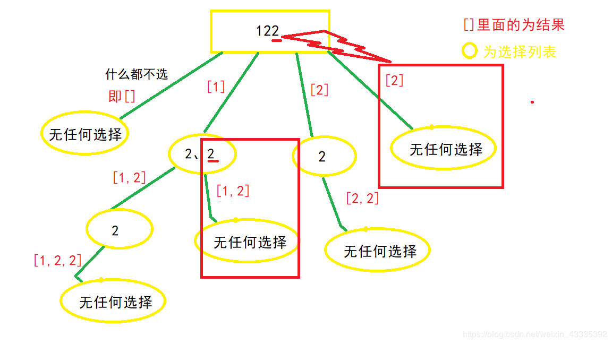
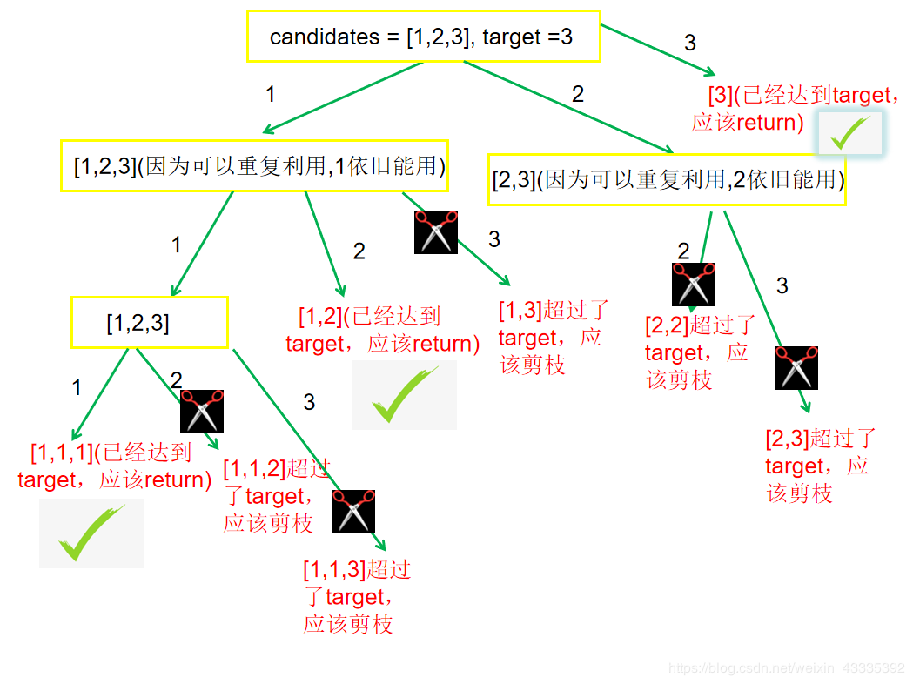

# 78. 子集

> [LeetCode 原题链接](https://leetcode.cn/problems/subsets/)

## 题目描述

给你一个整数数组 nums ，数组中的元素 互不相同 。返回该数组所有可能的子集（幂集）。

解集 不能 包含重复的子集。你可以按 任意顺序 返回解集。

### 示例 1

```text
输入：nums = [1,2,3]
输出：[[],[1],[2],[1,2],[3],[1,3],[2,3],[1,2,3]]
```

### 示例 2

```text
输入：nums = [0]
输出：[[],[0]]
```

### 提示

- 1 <= nums.length <= 10
- -10 <= nums[i] <= 10
- nums 中的所有元素 互不相同

---

## 原文解题记录

DFS和回溯法主要区别在于**状态重置**，DFS在访问过一个结点之后会标记为访问过，这个标记不会被撤销。回溯法也会对结点进行标记，但是在回溯之后会撤销这个标记。例如寻找条路径，DFS在找到一条后就会结束，回溯法可以将所有的路径找到。

**解题思路：**

**1.DFS和回溯算法区别**

DFS是一个劲的往某一个方向搜索，而回溯算法建立在DFS基础之上的，但不同的是在搜索过程中，达到结束条件后，恢复状态，回溯上一层，再次搜索。因此回溯算法与DFS的区别就是**有无状态重置****。**

**2.何时使用回溯算法**

**当问题需要"回头"，以此来查找出所有的解的时候**，使用回溯算法。即满足结束条件或者发现不是正确路径的时候(走不通)，要撤销选择，回退到上一个状态，继续尝试，直到找出所有解为止

**3.怎么样写回溯算法(从上而下，※代表难点，根据题目而变化)**

**①画出递归树，找到状态变量(回溯函数的参数)，这一步非常重要**※

**②根据题意，确立结束条件**

**③找准选择列表(与函数参数相关),与第一步紧密关联**※

**④判断是否需要剪枝**

**⑤****作出****选择，递归调用，进入下一层**

**⑥撤销选择**

**4.回溯问题的类型**

这里先给出，我总结的回溯问题类型，并给出相应的leetcode题目(一直更新)，然后再说如何去编写。**特别关注搜索类型的**，搜索类的搞懂，你就真的搞懂回溯算法了，是前面两类是基础，帮助你培养思维。

| 类型 | 题目链接 |
| --- | --- |
| 子集、组合 | 、、组合、、 |
| 全排列 | 、、字符串的全排列、 |
| **搜索** | 、、、、 |
| **注意：子集、组合与排列是不同性质的概念。子集、组合是无关顺序的，而排列是和元素顺序有关的，如**** ****[1，2]**** ****和**** ****[2，1]**** ****是同一个组合(子集)，但**** ****[1,2]**** ****和**** ****[2,1]**** ****是两种不一样的排列！！！！因此被分为两类问题** | **注意：子集、组合与排列是不同性质的概念。子集、组合是无关顺序的，而排列是和元素顺序有关的，如**** ****[1，2]**** ****和**** ****[2，1]**** ****是同一个组合(子集)，但**** ****[1,2]**** ****和**** ****[2,1]**** ****是两种不一样的排列！！！！因此被分为两类问题** |

**5.回到子集、组合类型问题上来(ABC三道例题)**

**A、 **** **

**给定一组不含重复元素的整数数组****nums****，返回该数组所有可能的子集（幂集）。**

解题步骤如下

**①递归树**

<p align="center"></p>

观察上图可得，**选择列表里的数，都是选择路径(红色框)后面的数**，比如[1]这条路径，他后面的选择列表只有 "2、3"，[2] 这条路径后面只有 "3" 这个选择，那么这个时候，就应该 **使用一个参数start，来标识当前的选择列表的起始位置。也就是标识每一层的状态，因此被形象的称为 "状态变量"**，最终函数签名如下

//nums为题目中的给的数组

//path为路径结果，要把每一条path加入结果集

void backtrack(vector<int>nums,vector<int>&path,int start)

**②****找结束****条件**

此题非常特殊，所有路径都应该加入结果集，所以不存在结束条件。或者说当start参数越过数组边界的时候，程序就自己跳过下一层递归了，因此不需要手写结束条件,直接加入结果集

**res为结果集，是全局变量vector<vector<int>>res,到时候要返回的

res.push_back(path);//把每一条路径加入结果集

**③****找选择****列表**

在①中已经提到过了，子集问题的选择列表，是上一条选择路径之后的数,即

for(int i=start;i<nums.size();i++)

**④判断是否需要剪枝**

从递归树中看到，路径没有重复的，也没有不符合条件的，所以不需要剪枝

**⑤做出选择(即for 循环里面的)**

void backtrack(vector<int>nums,vector<int>&path,int start)

{

for(int i=start;i<nums.size();i++)

{

path.push_back(nums[i]);//做出选择

backtrack(nums,path,i+1);//递归进入下一层，注意i+1，标识下一个选择列表的开始位置，最重要的一步

}

}

**⑤撤销选择**

整体的backtrack函数如下

void backtrack(vector<int>nums,vector<int>&path,int start)

{

res.push_back(path);

for(int i=start;i<nums.size();i++)

{

path.push_back(nums[i]);//做出选择

backtrack(nums,path,i+1);//递归进入下一层，注意i+1，标识下一个选择列表的开始位置，最重要的一步

path.pop_back();//撤销选择

}

}

**B、****子集 II****(剪枝思想)**

**问题描述:**

给定一个可能 **包含重复元素** 的整数数组 nums，返回该数组所有可能的子集（幂集）。

输入: [1,2,2]
输出:
[
[2],
[1],
[1,2,2],
[2,2],
[1,2],
[]
]

**解题步骤**

**①递归树**

<p align="center"></p>

可以发现，树中出现了大量重复的集合，②和③和第一个问题一样，不再赘述，我们直接看第四步

**④判断是否需要剪枝，需要先对数组排序，使用排序函数 sort(****nums.begin****(),****nums.end****())**

显然我们需要去除重复的集合，即需要剪枝，把递归树上的某些分支剪掉。那么应去除哪些分支呢？又该如何编码呢？

**观察上图不难发现，应该去除当前选择列表中，与上一个数重复的那个数，引出的分支，**如“2，2”这个选择列表，第二个“2”是最后重复的，应该去除这个“2”引出的分支

<p align="center"></p>

(去除图中红色大框中的分支)

编码呢，刚刚说到是“去除当前选择列表中，与上一个数重复的那个数，引出的分支”，说明当前列表最少有两个数，当i>start时，做选择的之前，比较一下当前数，与上一个数 (i-1) 是不是相同，相同则continue,

void backtrack(vector<int>& nums,vector<int>&path,int start)

{

res.push_back(path);

for(int i=start;i<nums.size();i++)

{

if(i>start&&nums[i]==nums[i-1])//剪枝去重

continue;

}

}

**⑤做出选择**

void backtrack(vector<int>& nums,vector<int>&path,int start)

{

res.push_back(path);

for(int i=start;i<nums.size();i++)

{

if(i>start&&nums[i]==nums[i-1])//剪枝去重

continue;

temp.push_back(nums[i]);

backtrack(nums,path,i+1);

}

}

**⑥撤销选择**

整体的backtrack函数如下

** sort(nums.begin(),nums.end());

void backtrack(vector<int>& nums,vector<int>&path,int start)

{

res.push_back(path);

for(int i=start;i<nums.size();i++)

{

if(i>start&&nums[i]==nums[i-1])//剪枝去重

continue;

temp.push_back(nums[i]);

backtrack(nums,path,i+1);

temp.pop_back();

}

}

**C、****组合总和**** - 问题描述**

给定一个无重复元素的数组candidates和一个目标数target，找出candidates中所有可以使数字和为target的组合。

candidates中的数字可以**无限制重复被选取**。

输入: candidates = [1,2,3], target = 3,
所求解集为:
[
[1,1,1],
[1,2],
[3]
]

**解题步骤**

**①递归树**

<p align="center"></p>

(绿色箭头上面的是路径，红色框[]则为结果，黄色框为选择列表)

从上图看出，组合问题和子集问题一样，（1,2）和（2,1）是同一个组合，因此 **需要引入start参数标识，每个状态中选择列表的起始位置**。另外，每个状态还需要一个sum变量，来记录当前路径的和，函数签名如下

void backtrack(vector<int>& nums,vector<int>&path,int start,int sum,int target)

**②****找结束****条件**

由题意可得，当路径总和等于target时候，就应该把路径加入结果集，并return

if(target==sum)

{

res.push_back(path);

return;

}

**③****找选择****列表**

for(int i=start;i<nums.size();i++)

**④判断是否需要剪枝**

从①中的递归树中发现，当前状态的sum大于target的时候就应该剪枝，不用再递归下去了

for(int i=start;i<nums.size();i++)

{

if(sum>target)//剪枝

continue;

}

**⑤做出选择**

题中说数可以无限次被选择，那么 i 就不用 +1 。即下一层的选择列表，从自身开始。并且要更新当前状态的sum

for(int i=start;i<nums.size();i++)

{

if(sum>target)

continue;

path.push_back(nums[i]);

backtrack(nums,path,i,sum+nums[i],target);//i不用+1(重复利用)，并更新当前状态的sum

}

**⑤撤销选择**

整体的backtrack函数如下

void backtrack(vector<int>& nums,vector<int>&path,int start,int sum,int target)

{

for(int i=start;i<nums.size();i++)

{

if(sum>target)

continue;

path.push_back(nums[i]);

backtrack(nums,path,i,sum+nums[i],target);//更新i和当前状态的sum

pacht.pop_back();

}

}

**总结：**

子集、组合类问题，关键是用一个**start参数**来控制选择列表！！最后回溯六步走：

**①画出递归树，找到状态变量(回溯函数的参数)，这一步非常重要**※

**②根据题意，确立结束条件**

**③找准选择列表(与函数参数相关),与第一步紧密关联**※

**④判断是否需要剪枝**

**⑤****作出****选择，递归调用，进入下一层**

**⑥撤销选择**
