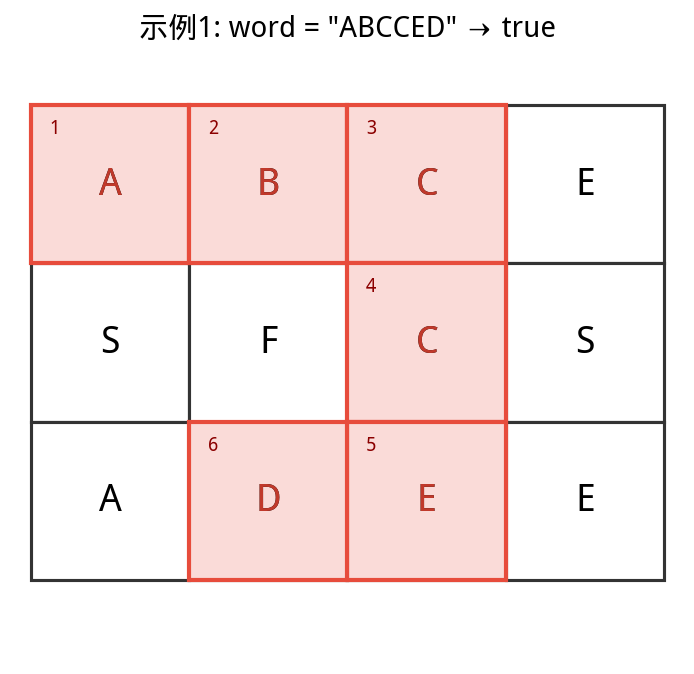
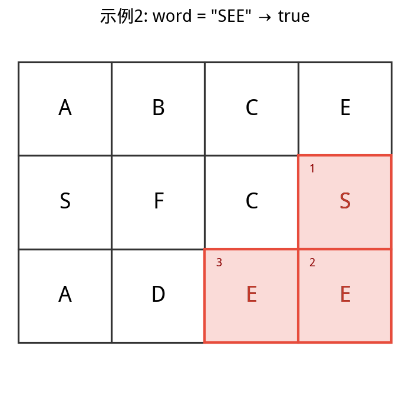
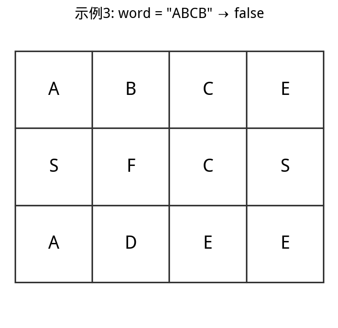

# 79. 单词搜索

> 题目链接：[https://leetcode.cn/problems/word-search/description/](https://leetcode.cn/problems/word-search/description/)

给定一个 $m \times n$ 二维字符网格 `board` 和一个字符串单词 `word`。如果 `word` 存在于网格中，返回 `true`；否则，返回 `false`。

单词必须按照字母顺序，通过相邻的单元格内的字母构成，其中「相邻」单元格是那些水平相邻或垂直相邻的单元格。同一个单元格内的字母不允许被重复使用。

## 示例 1

**输入：** board = [["A","B","C","E"],["S","F","C","S"],["A","D","E","E"]], word = "ABCCED"
**输出：** true

（路径 A→B→C→C→E→D 在图中以红色高亮显示）



## 示例 2

**输入：** board = [["A","B","C","E"],["S","F","C","S"],["A","D","E","E"]], word = "SEE"
**输出：** true

（路径 S→E→E 在图中以红色高亮显示）



## 示例 3

**输入：** board = [["A","B","C","E"],["S","F","C","S"],["A","D","E","E"]], word = "ABCB"
**输出：** false

（无法找到路径构成 "ABCB"）



## 提示

- `m == board.length`
- `n = board[i].length`
- $1 \le m, n \le 6$
- $1 \le \text{word.length} \le 15$
- `board` 和 `word` 仅由大小写英文字母组成

**进阶：** 你可以使用搜索剪枝的技术来优化解决方案，使其在 `board` 更大的情况下可以更快解决问题？

---

## 解题思路

本问题是典型的回溯问题，需要使用**深度优先搜索（DFS）+ 剪枝**解决。

- **深度优先搜索：** 即暴力法遍历矩阵中所有字符串可能性。DFS 通过递归，先朝一个方向搜到底，再回溯至上个节点，沿另一个方向搜索，以此类推。
- **剪枝：** 在搜索中，遇到「这条路不可能和目标字符串匹配成功」的情况，例如当前矩阵元素和目标字符不匹配、或此元素已被访问，则应立即返回，从而避免不必要的搜索分支。

`word = "ABCCED"`

### 算法解析

**递归参数：** 当前元素在矩阵 `board` 中的行列索引 `i` 和 `j`，当前目标字符在 `word` 中的索引 `k`。

**终止条件：**

1. 返回 `false`：（1）行或列索引越界 或 （2）当前矩阵元素与目标字符不同 或 （3）当前矩阵元素已访问过（（3）可合并至（2））。
2. 返回 `true`： `k = len(word) - 1`，即字符串 `word` 已全部匹配。

**递推工作：**

1. **标记当前矩阵元素：** 将 `board[i][j]` 修改为空字符 `'\0'`，代表此元素已访问过，防止之后搜索时重复访问。
2. **搜索下一单元格：** 朝当前元素的上、下、左、右四个方向开启下层递归，使用或连接（代表只需找到一条可行路径就直接返回，不再做后续 DFS），并记录结果至 `res`。
3. **还原当前矩阵元素：** 将 `board[i][j]` 元素还原至初始值，即 `word[k]`。

**返回值：** 返回布尔量 `res`，代表是否搜索到目标字符串。

> 使用空字符（Python: `""`，Java/C++: `"\0"`）做标记是为了防止标记字符与矩阵原有字符重复。当存在重复时，此算法会将矩阵原有字符认作标记字符，从而出现错误。

### 代码

```cpp
class Solution {
public:
    bool exist(vector<vector<char>>& board, string word) {
        rows = board.size();
        cols = board[0].size();
        for (int i = 0; i < rows; i++) {
            for (int j = 0; j < cols; j++) {
                if (dfs(board, word, i, j, 0)) return true;
            }
        }
        return false;
    }

private:
    int rows, cols;

    bool dfs(vector<vector<char>>& board, string word, int i, int j, int k) {
        if (i >= rows || i < 0 || j >= cols || j < 0 || board[i][j] != word[k])
            return false;
        if (k == word.size() - 1) return true;

        board[i][j] = '\0';
        bool res = dfs(board, word, i + 1, j, k + 1)
                || dfs(board, word, i - 1, j, k + 1)
                || dfs(board, word, i, j + 1, k + 1)
                || dfs(board, word, i, j - 1, k + 1);
        board[i][j] = word[k];
        return res;
    }
};
```

### 复杂度分析

在代码中，$M, N$ 分别为矩阵行列大小，$K$ 为字符串 `word` 长度。

- **时间复杂度 $O(3^K \cdot M \cdot N)$：** 最差情况下，需要遍历矩阵中长度为 $K$ 字符串的所有方案，时间复杂度为 $O(3^K)$；矩阵中共有 $M \cdot N$ 个起点，时间复杂度为 $O(M \cdot N)$。

  > **方案数计算：** 设字符串长度为 $K$，搜索中每个字符有上、下、左、右四个方向可以选择，舍弃回头（上个字符）的方向，剩下 3 种选择，因此方案数的复杂度为 $O(3^K)$。

- **空间复杂度 $O(K)$：** 搜索过程中的递归深度不超过 $K$，因此系统因函数调用累计使用的栈空间占用 $O(K)$（因为函数返回后，系统调用的栈空间会释放）。最坏情况下 $K = M \cdot N$，递归深度为 $M \cdot N$，此时系统栈使用 $O(M \cdot N)$ 的额外空间。
