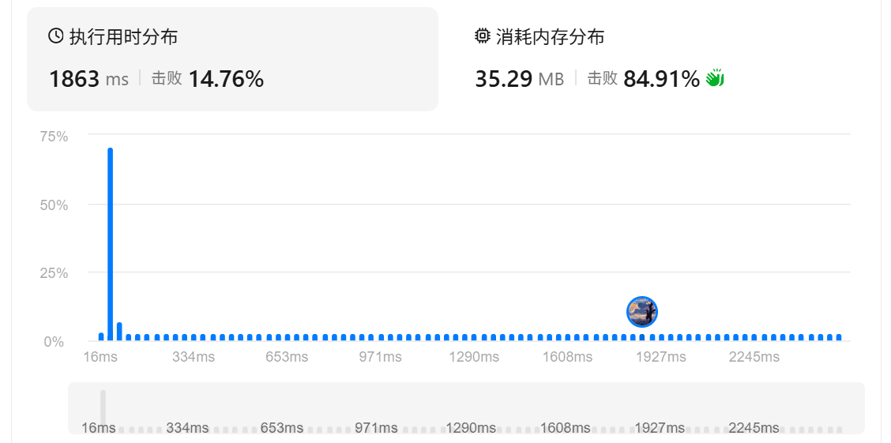
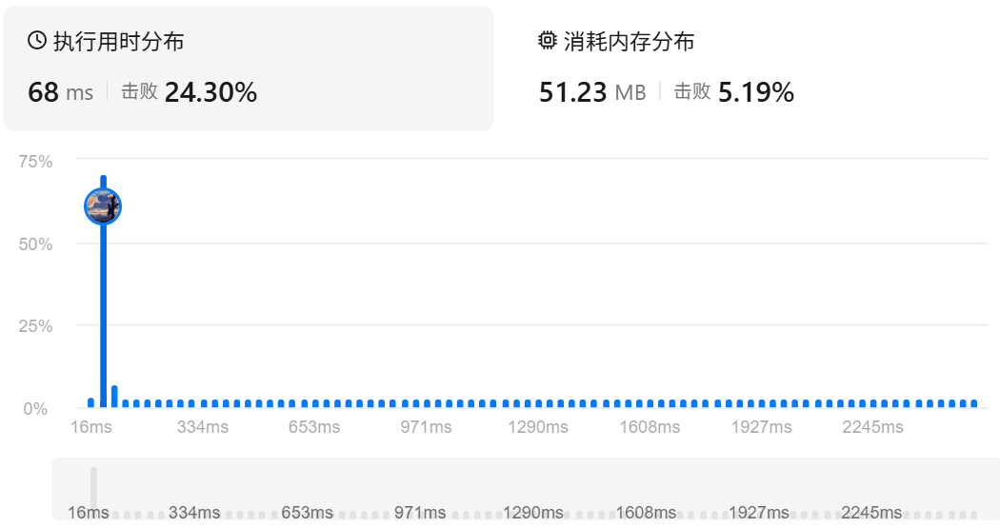
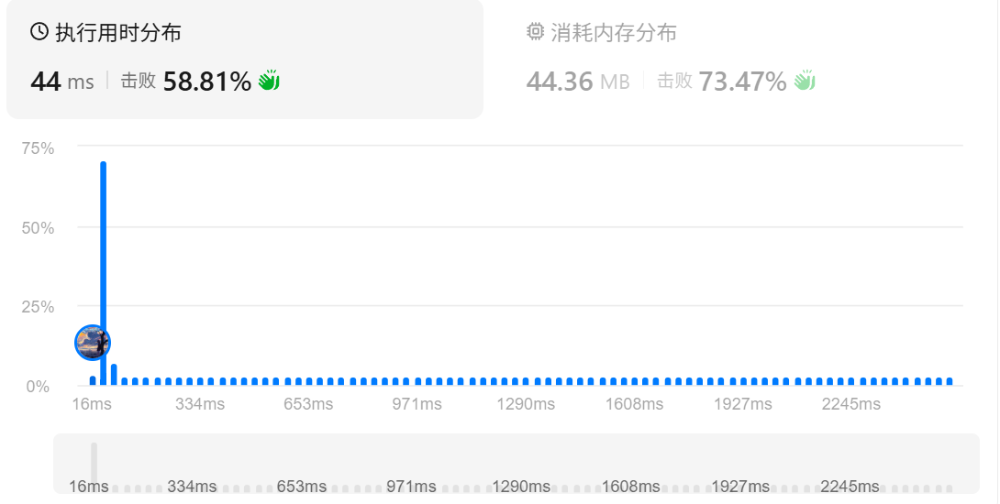

# 560. 和为 K 的子数组

> [LeetCode 原题链接](https://leetcode.cn/problems/subarray-sum-equals-k/)

## 题目描述

给你一个整数数组 nums 和一个整数 k ，请你统计并返回 该数组中和为 k 的子数组的个数 。

子数组是数组中元素的连续非空序列。

### 示例 1

```text
输入：nums = [1,1,1], k = 2
输出：2
```

### 示例 2

```text
输入：nums = [1,2,3], k = 3
输出：2
```

### 提示

- 1 <= nums.length <= 2 * 104
- -1000 <= nums[i] <= 1000
- -107 <= k <= 107

---

## 原文解题记录

**谨记： 数组不是单调的话，不要用滑动窗口，考虑用前缀和****，**

**连续子数组和问题，可以用前缀和处理**

**解题思路**

题目要求找出数组中和为 k 的**连续子数组**的个数。注意“连续”二字，这是核心。你的代码用了排序和双指针，但排序会打乱原数组顺序，导致无法判断连续子数组，所以方法不对。

**第一步：理解题意**

比如 nums = [1,2,3], k = 3。连续子数组有：

[1,2] 和为3 → 算一个

[3] 和为3 → 算一个

所以答案是2。不能排序，因为一旦排序就不知道哪些元素原本是挨着的。

**第二步：正确思路方向**

既然要找连续子数组的和，很自然想到用**前缀****和**。

**什么是前缀和？**

定义pre[i]表示从数组开头到第i个元素的累加和。

那么任意一段连续子数组[j..i]的和就等于pre[i] - pre[j-1]。

我们要找的是pre[i] - pre[j-1] == k，即**前缀和****pre[j-1]** == pre[i] - k。

所以遍历数组时，每到一个位置i，看看之前有没有出现过前缀和等于pre[i] - k的，如果有，说明找到了一个或多个符合条件的子数组。

**前缀和核心思路**

- 固定右端点i

- 枚举左端点j（0 到 i）

- sum[i] - sum[j-1]就是[j,i]的和

内层循环 j 的范围应该是 0 <= j <= i

**第三步：如何高效实现**

用一个哈希表记录每个前缀和出现的次数。

遍历数组，计算当前前缀和curSum。

检查curSum - k是否在哈希表中，如果在，就把它的出现次数加到结果里。

然后把当前curSum存入哈希表（次数+1）。

初始时，哈希表里先放一个{0:1}，代表前缀和为0的情况出现了1次（空数组），这样能正确处理从开头开始的子数组。

**第四步：易错点提醒**

哈希表一定要先查询再更新，否则会把当前的前缀和也算进去，导致多算。

注意curSum - k可能为负数，但哈希表的键可以是负数，没问题。

**总结**

核心思想：前缀和 + 哈希表，将连续子数组求和问题转化为查找差值是否存在。时间复杂度O(n)，空间复杂度O(n)。

**考虑用到的数组下标可能出现越界，本题很好的给了我们一个示例。**

**暴力做法：**

sum[]从下标1开始存起，初始化大小为nums.size() + 1,数组中元素全部初始化为0

```cpp
class Solution {

public:

int subarraySum(vector<int>& nums, int k) {

int cnt = 0;

vector<int> sum(nums.size()+1, 0);

for(int i = 1; i <= nums.size(); i++)

{

sum[i] = sum[i-1] + nums[i-1];

for(int j = 0; j < i; j++)

if(sum[i] - sum[j] == k) cnt++;

}

return cnt;

}

};
```

<p align="center"></p>

**hash表优化Ⅰ**

<p align="center"></p>

优化：hash表

hash表空间优化，注意要先查询后更新

```cpp
class Solution {

public:

int subarraySum(vector<int>& nums, int k) {

int cnt = 0;

vector<int> sum(nums.size()+1, 0);

unordered_map<int,int> res;

res[0] = 1;

for(int i = 1; i <= nums.size(); i++)

{

sum[i] = sum[i-1] + nums[i-1];

cnt += res[sum[i] - k];

res[sum[i]]++;

}

return cnt;

}

};
```

**hash表优化Ⅱ**

<p align="center"></p>

我们可以一边计算前缀和，一边遍历前缀和

在同一轮循环中，先把 sum[i−1] 加入哈希表，再根据 sum[i] 更新答案。

这样写无需初始化 res[0]=1。

```cpp
class Solution {

public:

int subarraySum(vector<int>& nums, int k) {

int cnt = 0,sum = 0;

unordered_map<int,int> res;

for(auto c:nums)

{

res[sum] ++;

sum += c;

cnt += res.contains(sum - k) ? res[sum - k] : 0;

}

return cnt;

}

};
```
