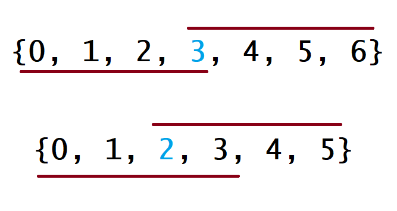
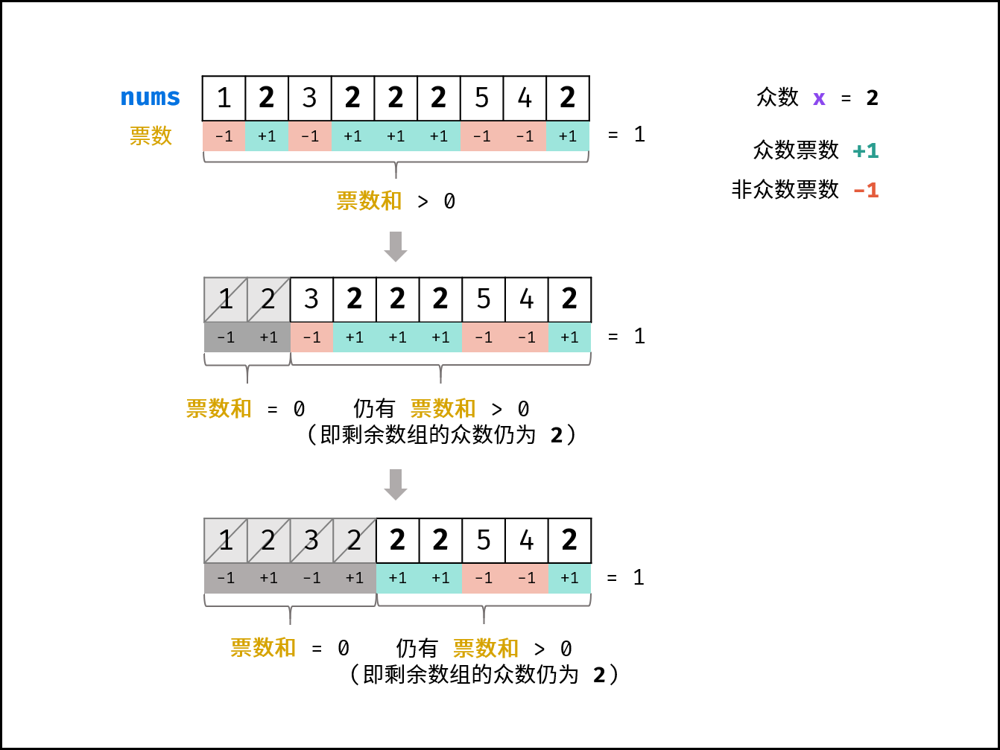

# 169. 多数元素

> [LeetCode 原题链接](https://leetcode.cn/problems/majority-element/)

## 题目描述

给定一个大小为 n 的数组 nums ，返回其中的多数元素。多数元素是指在数组中出现次数 大于 ⌊ n/2 ⌋ 的元素。

你可以假设数组是非空的，并且给定的数组总是存在多数元素。

### 示例 1

```text
输入：nums = [3,2,3]
输出：3
```

### 示例 2

```text
输入：nums = [2,2,1,1,1,2,2]
输出：2
```

### 提示

- n == nums.length
- 1 <= n <= 5 * 104
- -109 <= nums[i] <= 109
- 输入保证数组中一定有一个多数元素。

进阶：尝试设计时间复杂度为 O(n)、空间复杂度为 O(1) 的算法解决此问题。

---

## 原文解题记录

最简单的暴力方法：枚举数组中的每个元素，再遍历一遍数组统计其出现次数。该方法的时间复杂度是O(n2)，会超出时间限制，因此我们需要找出时间复杂度小于O(n2)的做法。

本题常见的三种解法：

- **哈希表统计法：** 遍历数组nums，用HashMap统计各数字的数量，即可找出众数 。此方法时间和空间复杂度均为O(N) 。

- **数组排序法：** 将数组nums排序，数组**中点**的元素一定为众数。

刚开始的时候没仔细读题，疑惑众数一定会出现在中点位置吗，像[1,1,2,2,3,3,3]明明中点的位置上是数字2，也不是众数啊，为什么题解中会有这种方法，怎么回事呢？其实题中给了条件**规定多数元素是指在数组中出现次数大于n/2的元素**，也就是排序后会出现在数组中点右边的数，所以这种方法也可以采用，主要是由于题目已经给了限定约束了。

- **摩尔投票法： **核心理念为**票数正负抵消**。此方法时间和空间复杂度分别为O(N)和O(1)，为本题的最佳解法。

**方法****一****：哈希表**

**思路**

我们知道出现次数最多的元素大于n/2次，所以可以用哈希表来快速统计每个元素出现的次数。

**算法**

我们使用哈希映射（HashMap）来存储每个元素以及出现的次数。对于哈希映射中的每个键值对，键表示一个元素，值表示该元素出现的次数。

我们用一个循环遍历数组nums并将数组中的每个元素加入哈希映射中。在这之后，我们遍历哈希映射中的所有键值对，返回值最大的键。我们同样也可以在遍历数组nums时候使用打擂台的方法，维护最大的值，这样省去了最后对哈希映射的遍历。

```cpp
class Solution {

public:

int majorityElement(vector<int>& nums) {

unordered_map<int, int> counts;

int majority = 0, cnt = 0;

for (int num: nums) {

++counts[num];

if (counts[num] > cnt) {

majority = num;

cnt = counts[num];

}

}

return majority;

}

};
```

**复杂度分析**

- **时间复杂度：**O(n)，其中n是数组nums的长度。我们遍历数组nums一次，对于nums中的每一个元素，将其插入哈希表都只需要常数时间。如果在遍历时没有维护最大值，在遍历结束后还需要对哈希表进行遍历，因为哈希表中占用的空间为O(n)（可参考下文的空间复杂度分析），那么遍历的时间不会超过O(n)。因此总时间复杂度为O(n)。

- **空间复杂度：**O(n)。哈希表最多包含n−n/2个键值对，所以占用的空间为O(n)。这是因为任意一个长度为n的数组最多只能包含n个不同的值，但题中保证nums一定有一个众数，会占用（最少）n/2+1个数字。因此最多有 n−( n/2+1) 个不同的其他数字，所以最多有 n− n/2个不同的元素。

**方法二：排序**

**思路**

如果将数组 nums 中的所有元素按照单调递增或单调递减的顺序排序，那么下标为n/2的元素（下标从0开始）一定是众数。

**算法**

对于这种算法，我们先将nums数组排序，然后返回上文所说的下标对应的元素。下面的图中解释了为什么这种策略是有效的。在下图中，第一个例子是n为奇数的情况，第二个例子是n为偶数的情况。

<p align="center"></p>

对于每种情况，数组上面的线表示如果众数是数组中的最小值时覆盖的下标，数组下面的线表示如果众数是数组中的最大值时覆盖的下标。对于其他的情况，这条线会在这两种极端情况的中间。对于这两种极端情况，它们会在下标为 n/2的地方有重叠。因此，无论众数是多少，返回 n/2下标对应的值都是正确的。

```cpp
class Solution {

public:

int majorityElement(vector<int>& nums) {

sort(nums.begin(), nums.end());

return nums[nums.size() / 2];

}

};
```

**复杂度分析**

- **时间复杂度：**O(nlogn)。将数组排序的时间复杂度为 O(nlogn)。

- **空间复杂度：**O(logn)。如果使用语言自带的排序算法，需要使用 O(logn) 的栈空间。如果自己编写堆排序，则只需要使用 O(1) 的额外空间。

**方法三：随机化**

**思路**

因为超过n/2的数组下标被众数占据了，这样我们随机挑选一个下标对应的元素并验证，有很大的概率能找到众数。

**算法**

由于一个给定的下标对应的数字很有可能是众数，我们随机挑选一个下标，检查它是否是众数，如果是就返回，否则继续随机挑选。

```cpp
class Solution {

public:

int majorityElement(vector<int>& nums) {

while (true) {

int candidate = nums[rand() % nums.size()];

int count = 0;

for (int num : nums)

if (num == candidate)

++count;

if (count > nums.size() / 2)

return candidate;

}

return -1;

}

};
```

**复杂度分析**

- **时间复杂度：**理论上最坏情况下的时间复杂度为 O(∞)，因为如果我们的运气很差，这个算法会一直找不到众数，随机挑选无穷多次，所以最坏时间复杂度是没有上限的。然而，运行的期望时间是线性的。先说服你自己：由于众数占据超过数组一半的位置，期望的随机次数会小于众数占据数组恰好一半的情况。因此期望的时间复杂度为 O(n)。

- **空间复杂度：**O(1)。随机方法只需要常数级别的额外空间。

**方法四：分治**

**思路**

如果数a是数组nums的众数，如果我们将nums分成两部分，那么a必定是至少一部分的众数。

我们可以使用反证法来证明这个结论。假设 a 既不是左半部分的众数，也不是右半部分的众数，那么 a 出现的次数少于 l / 2 + r / 2 次，其中 l 和 r 分别是左半部分和右半部分的长度。由于 l / 2 + r / 2 <= (l + r) / 2，说明 a 也不是数组 nums 的众数，因此出现了矛盾。所以这个结论是正确的。

这样以来，我们就可以使用分治法解决这个问题：将数组分成左右两部分，分别求出左半部分的众数 a1 以及右半部分的众数 a2，随后在 a1 和 a2 中选出正确的众数。

**算法**

我们使用经典的分治算法递归求解，直到所有的子问题都是长度为 1 的数组。长度为 1 的子数组中唯一的数显然是众数，直接返回即可。如果回溯后某区间的长度大于 1，我们必须将左右子区间的值合并。如果它们的众数相同，那么显然这一段区间的众数是它们相同的值。否则，我们需要比较两个众数在整个区间内出现的次数来决定该区间的众数。

```cpp
class Solution {

int count_in_range(vector<int>& nums, int target, int lo, int hi) {

int count = 0;

for (int i = lo; i <= hi; ++i)

if (nums[i] == target)

++count;

return count;

}

int majority_element_rec(vector<int>& nums, int lo, int hi) {

if (lo == hi)

return nums[lo];

int mid = (lo + hi) / 2;

int left_majority = majority_element_rec(nums, lo, mid);

int right_majority = majority_element_rec(nums, mid + 1, hi);

if (count_in_range(nums, left_majority, lo, hi) > (hi - lo + 1) / 2)

return left_majority;

if (count_in_range(nums, right_majority, lo, hi) > (hi - lo + 1) / 2)

return right_majority;

return -1;

}

public:

int majorityElement(vector<int>& nums) {

return majority_element_rec(nums, 0, nums.size() - 1);

}

};
```

**复杂度分析**

- **时间复杂度：**O(nlogn)。

- **空间复杂度：**O(logn)。尽管分治算法没有直接分配额外的数组空间，但在递归的过程中使用了额外的栈空间。算法每次将数组从中间分成两部分，所以数组长度变为 1 之前需要进行 O(logn) 次递归，即空间复杂度为 O(logn)。

**方法五：Boyer-Moore投票算法**

核心思想——**抵消原则**：

在一个数组中，如果某个元素的出现次数超过了数组长度的一半，那么这个元素与其他所有元素一一配对，最后仍然会剩下至少一个该元素。通过“投票”和“抵消”的过程，可以逐步消除不同的元素，最终留下的候选人就是可能的主要元素。

**思路**

**推论****一****：** 若记**众数**的票数为+1 ，**非众数**的票数为−1 ，则一定有所有数字的**票数和 **>0 。

**推论二：** 若数组的前a 个数字的**票数和**** **= 0，则 数组剩余 (n-a) 个数字的**票数和一定仍**** **> 0 ，即后 (n-a) 个数字的**众数仍为****x** 。

利用此特性，每轮假设发生**票数和 **= 0都可以**缩小剩余数组区间**。当遍历完成时，最后一轮假设的数字即为众数。

<p align="center"></p>

**算法****流程**

- **初始化：**票数统计votes = 0， 众数x。

- **循环：**遍历数组nums中的每个数字num。

- 当票数votes等于0，则假设当前数字num是众数。

- 当num = x时，票数votes自增1；当num != x时，票数votes自减1。

- **返回值：**返回x即可。

```cpp
class Solution {

public:

int majorityElement(vector<int>& nums) {

int vote = 0,x = 0; //初始化票数和众数

for(int i = 0;i < nums.size();i ++)

{

if(vote == 0)  x = nums[i];

if(x==nums[i]) vote += 1;

else vote -= 1;

}

return x;

}

};
```

我觉得最神的是if(vote == 0)  x = nums[i];这一步，当票数抵消为0时，谁就是当前的x，只有当能与当前的vote抵消时才能说明这个数有足够多的1或-1去抵消，其他的都是nums[i]，最后返回的x也就是从一句来的。

Boyer-Moore 算法的本质和方法四中的分治十分类似。

**复杂度分析**

- **时间复杂度：**O(n)。Boyer-Moore 算法只对数组（长度为n）进行了一次遍历。

- **空间复杂度：**O(1)。Boyer-Moore 算法只需要常数级别的额外空间（ votes 变量使用常数大小的额外空间）。
