# 3. 无重复字符的最长子串

> [LeetCode 原题链接](https://leetcode.cn/problems/longest-substring-without-repeating-characters/)

## 题目描述

给定一个字符串 `s`，请你找出其中不含有重复字符的最长子串的长度。

### 示例 1

```text
输入：s = "abcabcbb"
输出：3
解释：因为无重复字符的最长子串是 "abc"，所以其长度为 3。注意 "bca" 和 "cab" 也是正确答案。
```

### 示例 2

```text
输入：s = "bbbbb"
输出：1
解释：因为无重复字符的最长子串是 "b"，所以其长度为 1。
```

### 示例 3

```text
输入：s = "pwwkew"
输出：3
解释：因为无重复字符的最长子串是 "wke"，所以其长度为 3。
请注意，你的答案必须是子串的长度，"pwke" 是一个子序列，不是子串。
```

### 提示

- `0 <= s.length <= 5 * 10^4`
- `s` 由英文字母、数字、符号和空格组成

---

## 解题思路


### 思路

这道题主要用到思路是：**滑动窗口**

### 什么是滑动窗口？

其实就是一个**队列**,比如例题中的abcabcbb，进入这个队列（窗口）为 abc 满足题目要求，当再进入a，队列变成了abca，这时候不满足要求。**所以，我们要移动这个队列！**

### 如何移动？

我们只要把队列的**左边**的元素移出就行了，直到满足题目要求！

一直维持这样的队列，找出队列**出现最长的长度**时候，求出解！

**时间复杂度**：O(n)

<p align="center">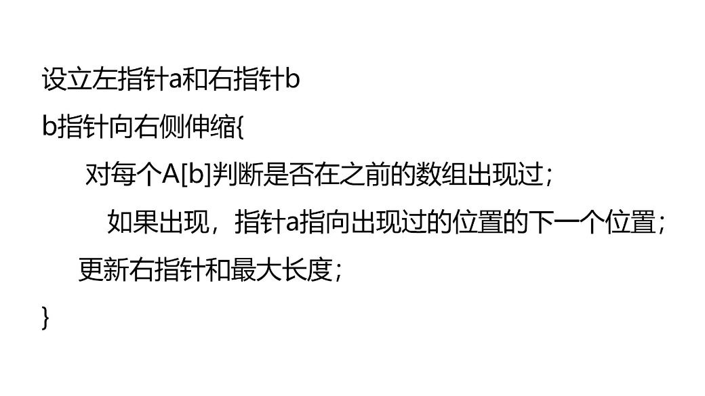</p>

### 滑动窗口题目:


### 方法一：滑动窗口 + 哈希表

| 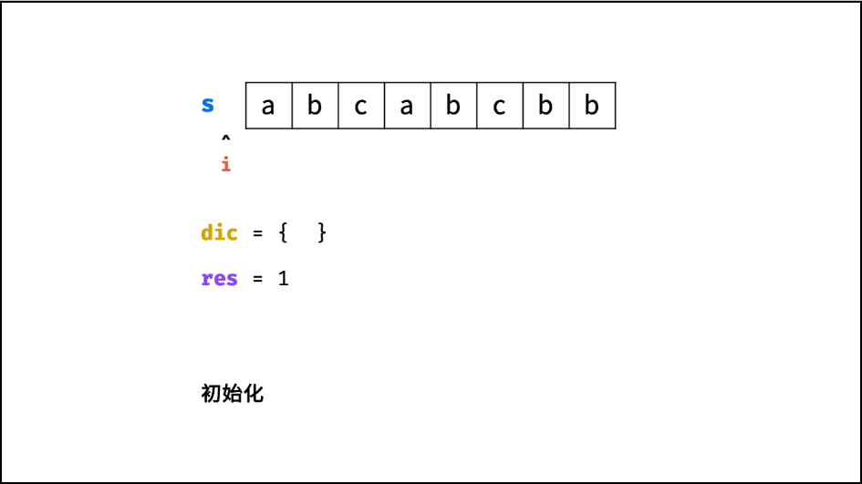1 | 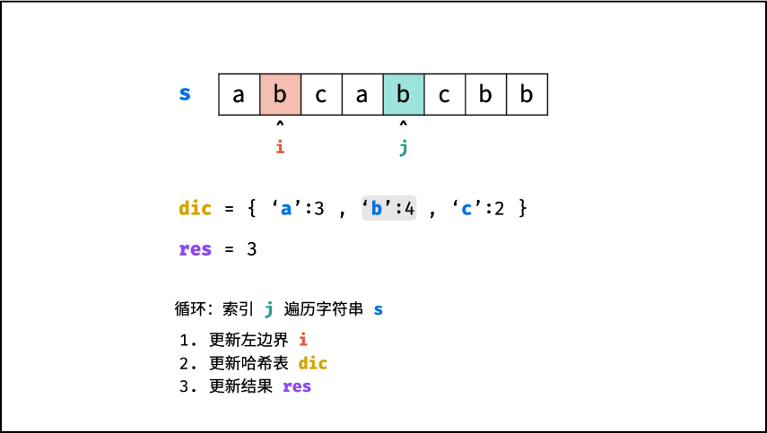6 |
| --- | --- |
| 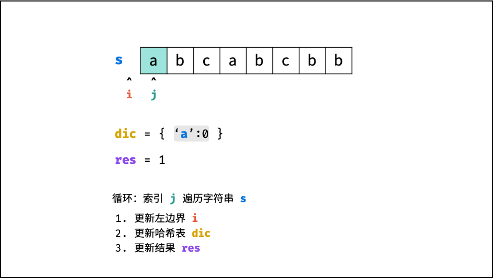2 | 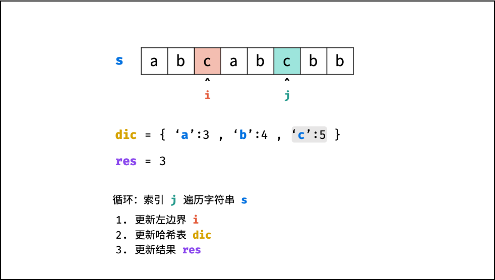7 |
| 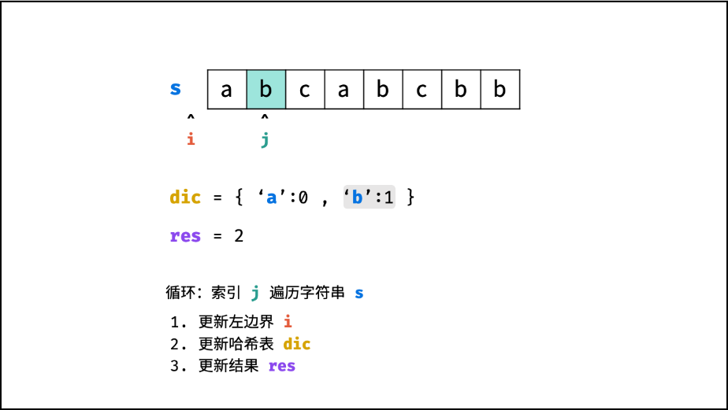3 | 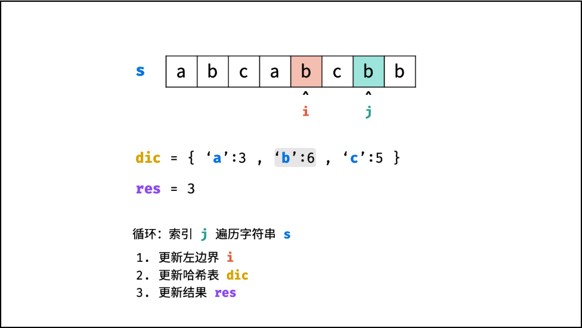8 |
| 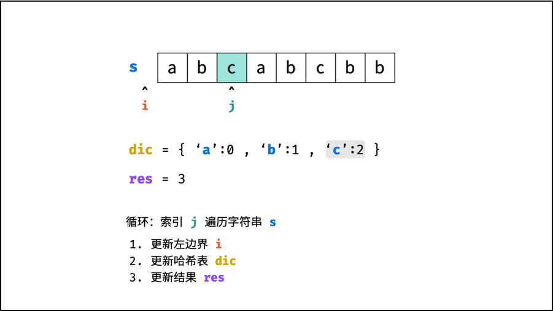4 | 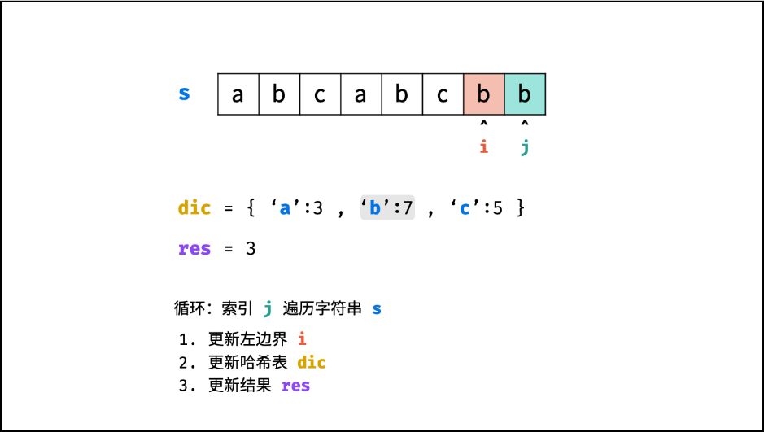9 |
| 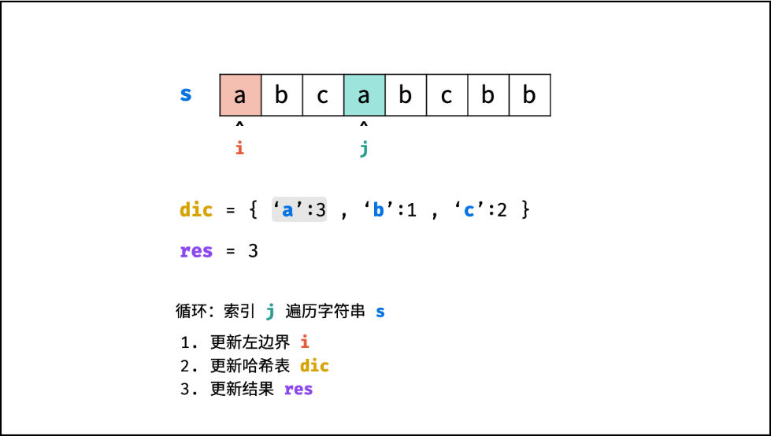5 | 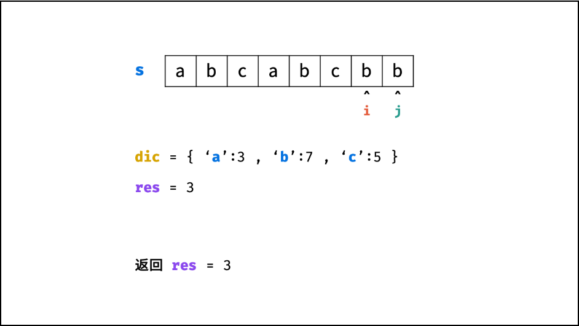10 |

哈希表（unordered_map）就是一个“字典”，用来存 **键-****-****>值******** **的对应关系。

三个最常用的操作：

- 插入/更新

```cpp
dic['a'] = 0;  ** // 把键'a'对应的值设为0，如果没有就新建，有就覆盖**
```

- 查找是否存在

```cpp
dic.count('a');  **        //返回1（存在）或0（不存在）**
```

```cpp
auto it = dic.find('a');

if (it != dic.end()) {} **   // it->first是键，it->second是值，****返回true表示存在**
```

- 取值

```cpp
int val = dic['a'];  ** // 取出 'a' 对应的值**
```

**注意：**如果用 dic['a'] 取一个不存在的键，会自动创建这个键并赋默认值（整数默认为 0），所以要先用count或find确认存在。

在本题的用法：

键：字符

值：该字符最近一次出现的下标

**左右指针就是****i,j**** **

**hash表中存在该键则更新左指针（hash表的键），不存在该键则更新右指针（hash表的键的值）**

初始化时，i为-1，最后的结果初始化为0，此时还没开始移动两个指针

以右窗口为扩展方向，一直向右探到数组尽头

hash表里s[j]为字符串数组中的字符，cnt[s[j]存的某个字符的下标，我们用hash表更新下表来表示窗口大小的更新

如果hash表里存在此时j所在的s[j]，那么就更新我们的**左指针**，从左边缩小窗口，取更大的那个（也就是取我们找到这个已经存在过的字符新遇到的这个）

但是一般不都右边的那个大吗，不是！如果进入hash表的顺序与后来遇到重复字符的顺序不同，如果直接将原来字符的下标赋值给i那不就乱了吗，可以看一下图二。

然后将新的下标重新存进hash表。

更新我们的窗口大小，怎么更新？取最大？怎么取最大，跟谁比？之前的窗口大小与当前右指针-左指针的大小比。

为什么不加一？一般长度不都是右减左加一吗{考虑到只存在一个字符时，i与j永远差1（因为初始化时i已经初始化为-1）}

循环到字符串结尾，返回我们的窗口大小。

<p align="center">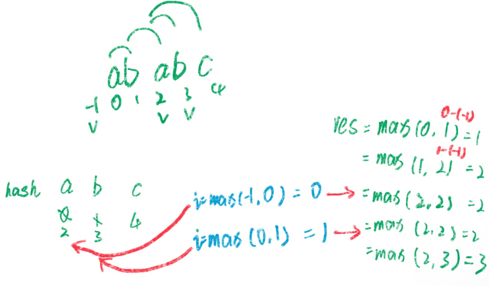</p>

图1.情况1

<p align="center">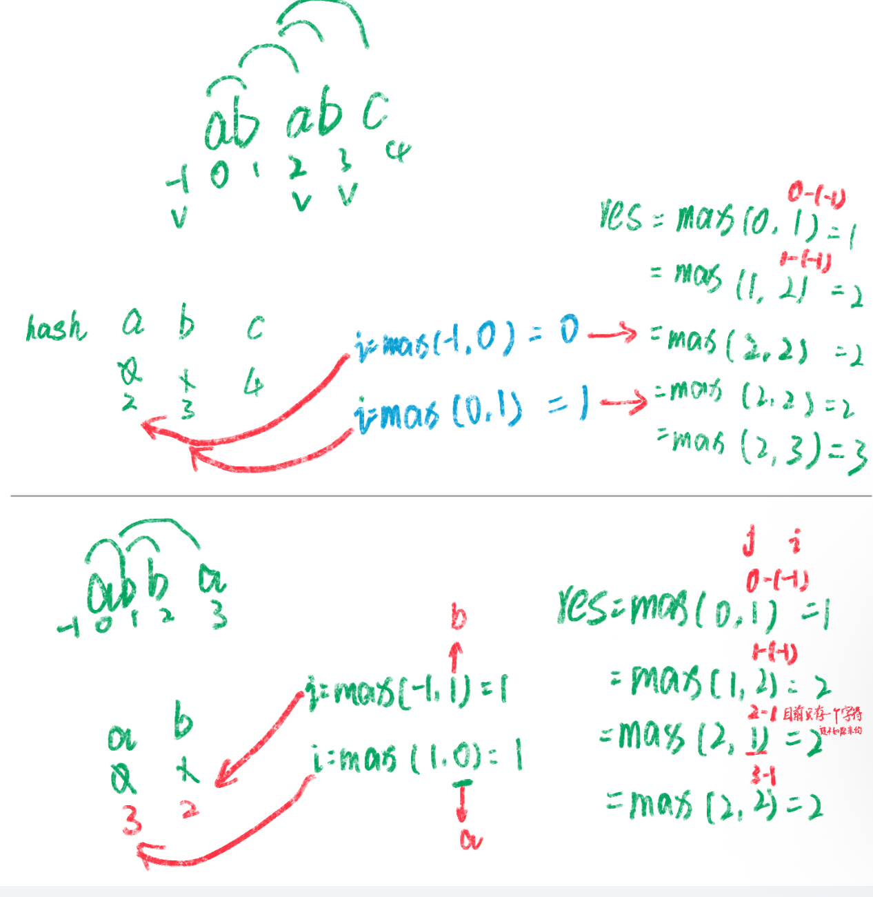</p>

图2.情况2

所以我觉得比较神的地方是那个i值也就是左指针的更新，怎么会想到取最大值呢，太妙了，其实也不难想，如果遇到和原来hash表中的键相同的就更新下标为当前最大的，但是**主要是考虑到遇到的重复字符的顺序不同的时候**，这里的更新思路就很妙。

### 方法二：动态规划 + 哈希表
