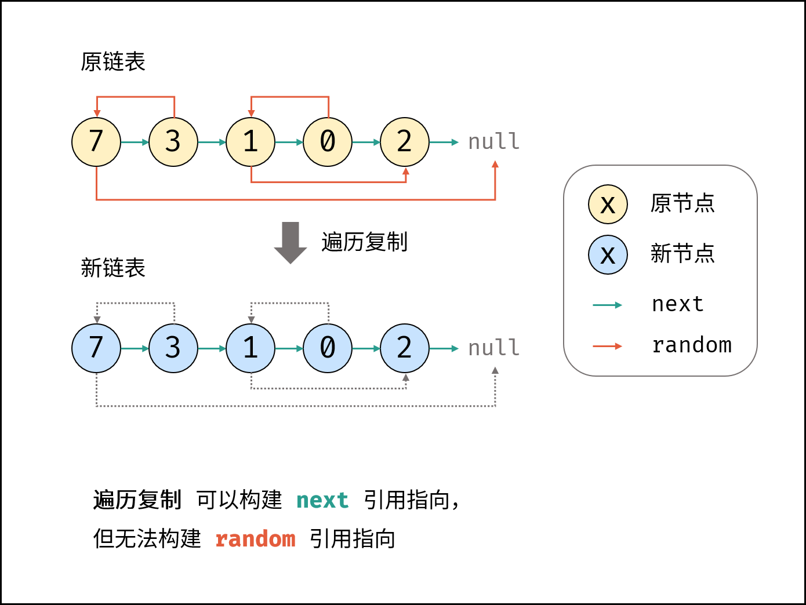
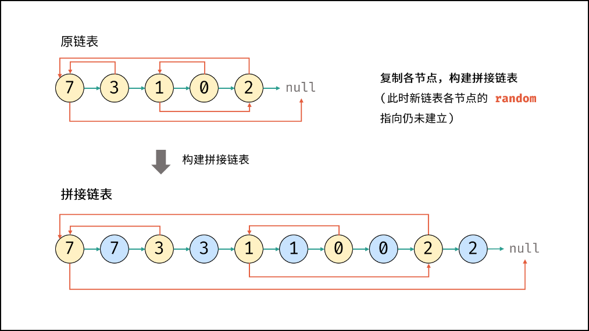
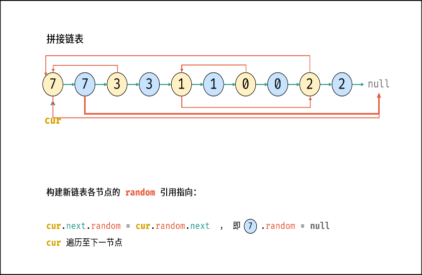
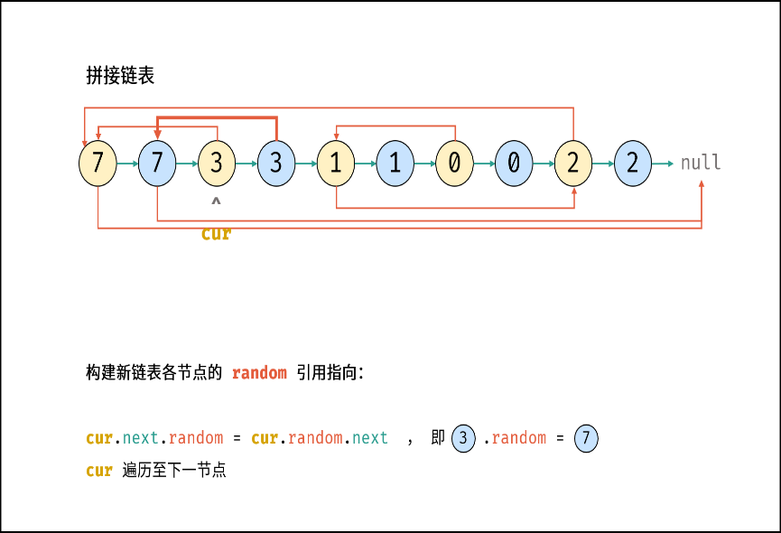
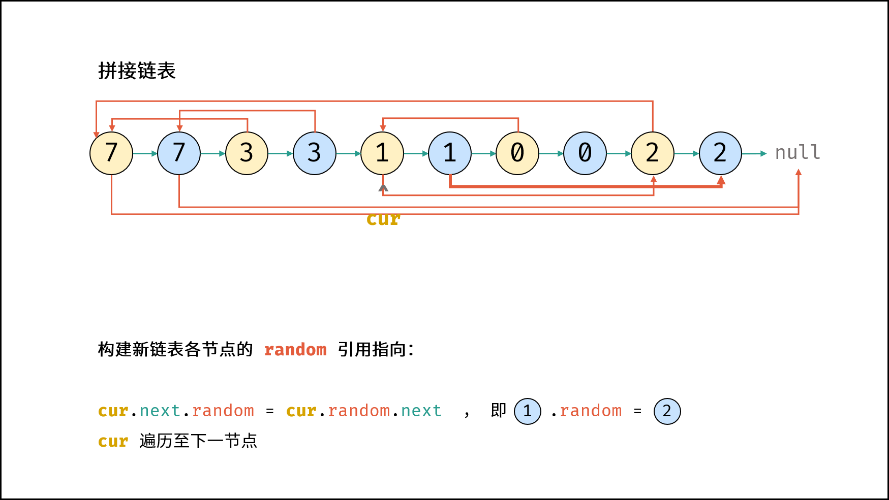
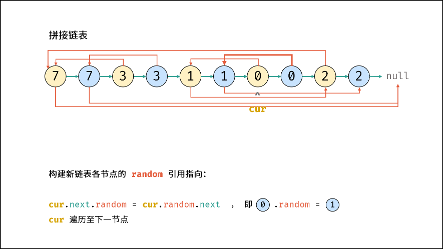
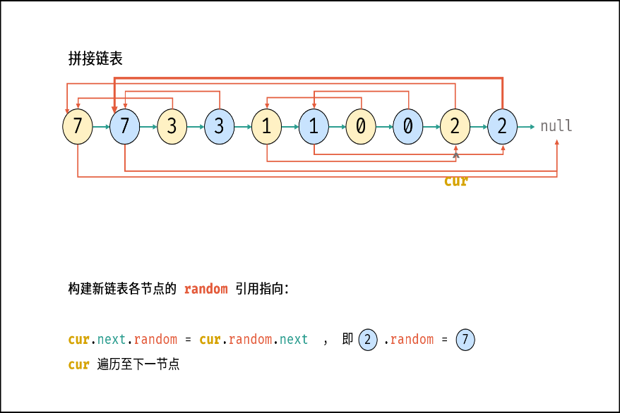
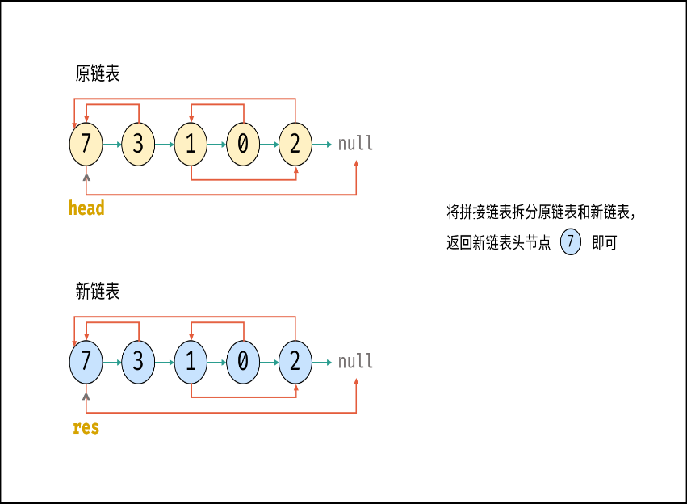

# 138. 随机链表的复制

> [LeetCode 原题链接](https://leetcode.cn/problems/copy-list-with-random-pointer/)

## 题目描述

给你一个长度为 n 的链表，每个节点包含一个额外增加的随机指针 random ，该指针可以指向链表中的任何节点或空节点。

构造这个链表的 深拷贝。 深拷贝应该正好由 n 个 全新 节点组成，其中每个新节点的值都设为其对应的原节点的值。新节点的 next 指针和 random 指针也都应指向复制链表中的新节点，并使原链表和复制链表中的这些指针能够表示相同的链表状态。复制链表中的指针都不应指向原链表中的节点 。

例如，如果原链表中有 X 和 Y 两个节点，其中 X.random --> Y 。那么在复制链表中对应的两个节点 x 和 y ，同样有 x.random --> y 。

返回复制链表的头节点。

用一个由 n 个节点组成的链表来表示输入/输出中的链表。每个节点用一个 [val, random_index] 表示：

- val：一个表示 Node.val 的整数。
- random_index：随机指针指向的节点索引（范围从 0 到 n-1）；如果不指向任何节点，则为  null 。

你的代码 只 接受原链表的头节点 head 作为传入参数。

### 示例 1

```text
输入：head = [[7,null],[13,0],[11,4],[10,2],[1,0]]
输出：[[7,null],[13,0],[11,4],[10,2],[1,0]]
```

### 示例 2

```text
输入：head = [[1,1],[2,1]]
输出：[[1,1],[2,1]]
```

### 示例 3

```text
输入：head = [[3,null],[3,0],[3,null]]
输出：[[3,null],[3,0],[3,null]]
```

### 提示

- 0 <= n <= 1000
- -104 <= Node.val <= 104
- Node.random 为 null 或指向链表中的节点。

---

## 原文解题记录

**题****一****上来给我看****懵****逼了**

**解题思路：**

普通链表的节点定义如下：

// Definition for a Node.

class Node {

```cpp
public:

int val;

Node* next;

Node(int _val) {

val = _val;

next = NULL;

}
```

};

本题链表的节点定义如下：

// Definition for a Node.

class Node {

```cpp
public:

int val;

Node* next;

Node* random;

Node(int _val) {

val = _val;

next = NULL;

random = NULL;

}
```

};

给定链表的头节点head ，复制普通链表很简单，**只需遍历链表，每轮建立新节点+构建前驱节点pre和当前节点node的引用指向**即可。

本题链表的节点新增了**random**指针，指向链表中的**任意节点**或者**null**。这个random指针意味着在复制过程中，除了构建前驱节点和当前节点的引用指向pre.next，还要构建**前驱节点和其**随机节点的引用指向pre.random。

**本题难点： 在复制链表的过程中构建新链表各节点的random引用指向。**

<p align="center"></p>

```cpp
class Solution {

public:

Node* copyRandomList(Node* head) {

Node* cur = head;

Node* dum = new Node(0), *pre = dum;

while(cur != nullptr) {

Node* node = new Node(cur->val); // 复制节点 cur

pre->next = node;                // 新链表的 前驱节点 -> 当前节点

**   // pre->random = "???****";   ****       // 新链表的「前驱节点->当前节点」无法确定**

cur = cur->next;                 // 遍历下一节点

pre = node;                      // 保存当前新节点

}

return dum->next;

}

};
```

本文介绍「哈希表」 ，「拼接+拆分」两种方法。哈希表方法比较直观；拼接+拆分方法的空间复杂度更低。

**方法****一****：哈希表**

利用哈希表的查询特点，考虑构建**原链表****节点**和**新链表对应节点**的键值对映射关系，再遍历构建新链表各节点的next和**random引用指向**即可。

**算法流程：**

- 若头节点head为空节点，直接返回null 。

- 初始化：哈希表dic，节点cur指向头节点。

- 复制链表：

- 建立新节点，并向dic添加键值对 (原cur节点, 新cur节点） 。

- cur遍历至原链表下一节点。

- 构建新链表的引用指向：

- 构建新节点的next和random引用指向。

- cur遍历至原链表下一节点。

- 返回值：新链表的头节点dic[cur] 。

**代码：**

```cpp
class Solution {

public:

Node* copyRandomList(Node* head) {

if(head == nullptr) return nullptr;

Node* cur = head;

unordered_map<Node*, Node*> map;

// 3. 复制各节点，并建立“原节点->新节点”的Map映射

while(cur != nullptr) {

map[cur] = new Node(cur->val);

cur = cur->next;

}

cur = head;

// 4. 构建新链表的next和random指向

while(cur != nullptr) {

map[cur]->next = map[cur->next];

map[cur]->random = map[cur->random];

cur = cur->next;

}

// 5. 返回新链表的头节点

return map[head];

}

};
```

**复杂度分析：**

时间复杂度O(N) ： 两轮遍历链表，使用O(N) 时间。

空间复杂度O(N) ： 哈希表dic使用线性大小的额外空间。

代码注意：

**这个是新开辟了一个空间**

- 哈希表里的键值都为指针类型需要带上*****，而不能单单只是一个对象node

- 最开始复制过去的是节点，而原来节点对应着原来的指向也不变，需要把指向也复制过去

- 复制完后，把cur重新从head开始！

- 最后返回的是map[head]

**方法二：拼接+拆分**

考虑构建**原****节点1**** ****->**** ****新节1 ->**** ****原节点2 -> 新节点2 -> …… **的拼接链表，如此便可在访问原节点的random指向节点的同时找到新对应新节点的random指向节点。

| <p align="center"></p> | <p align="center"></p> |
| --- | --- |
| <p align="center"></p> | <p align="center"></p> |
| <p align="center"></p> | <p align="center"></p> |
| <p align="center"></p> | <p align="center"></p> |

**算法流程：**

- **复制各节点，构建拼接链表：**设原链表为node1→node2→⋯，构建的拼接链表如下所示：

- node1→node1new→node2→node2new→⋯

- **构建新链表各节点的random指向：**当访问原节点cur的随机指向节点cur.random时，对应新节点cur.next的随机指向节点为cur.random.next 。

- **拆分原/新链表：**设置pre/cur分别指向原/新链表头节点，遍历执行pre.next = pre.next.next和cur.next = cur.next.next将两链表拆分开。

- **返回新链表的头节点res即可。**

**代码：**

```cpp
class Solution {

public:

Node* copyRandomList(Node* head) {

if(head == nullptr) return nullptr;

Node* cur = head;

// 1. 复制各节点，并构建拼接链表

while(cur != nullptr) {

Node* tmp = new Node(cur->val);

tmp->next = cur->next;

cur->next = tmp;

cur = tmp->next;

}

// 2. 构建各新节点的 random 指向

cur = head;

while(cur != nullptr) {

if(cur->random != nullptr)

cur->next->random = cur->random->next;

cur = cur->next->next;

}

// 3. 拆分两链表

cur = head->next;

Node* pre = head, *res = head->next;

while(cur->next != nullptr) {

pre->next = pre->next->next;

cur->next = cur->next->next;

pre = pre->next;

cur = cur->next;

}

pre->next = nullptr; // 单独处理原链表尾节点

return res;      // 返回新链表头节点

}

};
```

**复杂度分析：**

时间复杂度O(N) ： 三轮遍历链表，使用O(N)时间。

空间复杂度O(1) ： 节点引用变量使用常数大小的额外空间。
