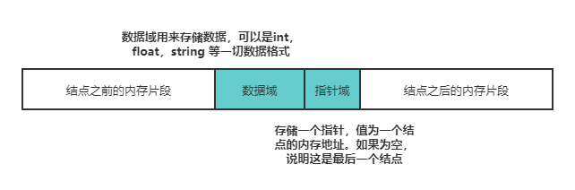
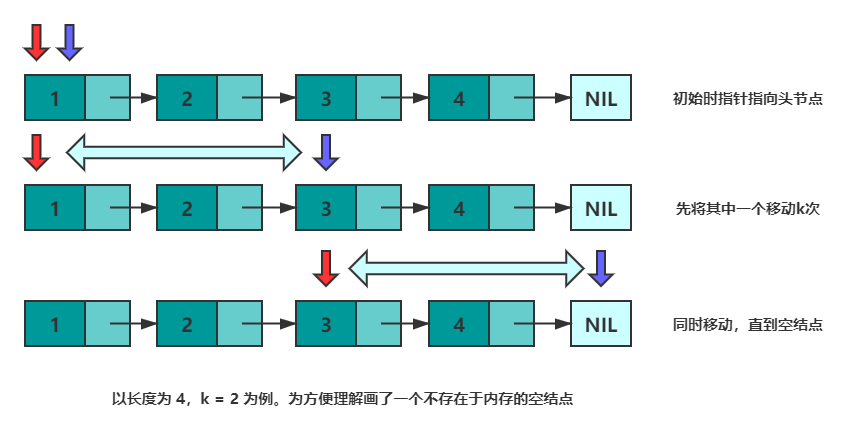
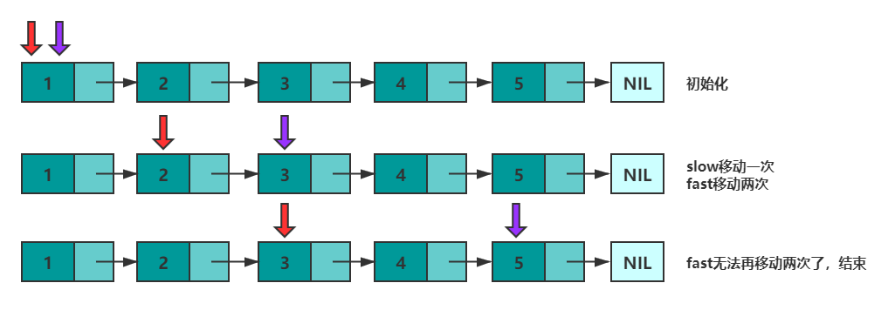
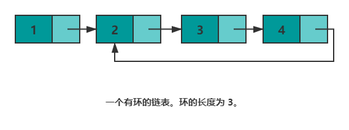
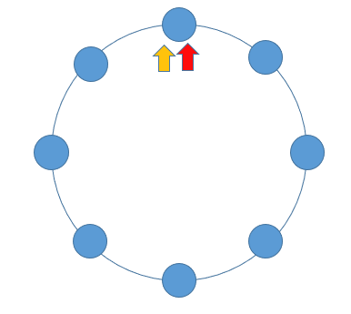

# 141. 环形链表

> [LeetCode 原题链接](https://leetcode.cn/problems/linked-list-cycle/)

## 题目描述

给你一个链表的头节点 head ，判断链表中是否有环。

如果链表中有某个节点，可以通过连续跟踪 next 指针再次到达，则链表中存在环。 为了表示给定链表中的环，评测系统内部使用整数 pos 来表示链表尾连接到链表中的位置（索引从 0 开始）。注意：pos 不作为参数进行传递 。仅仅是为了标识链表的实际情况。

如果链表中存在环 ，则返回 true 。 否则，返回 false 。

### 示例 1

```text
输入：head = [3,2,0,-4], pos = 1
输出：true
解释：链表中有一个环，其尾部连接到第二个节点。
```

### 示例 2

```text
输入：head = [1,2], pos = 0
输出：true
解释：链表中有一个环，其尾部连接到第一个节点。
```

### 示例 3

```text
输入：head = [1], pos = -1
输出：false
解释：链表中没有环。
```

### 提示

- 链表中节点的数目范围是 [0, 104]
- -105 <= Node.val <= 105
- pos 为 -1 或者链表中的一个 有效索引 。

进阶：你能用 O(1)（即，常量）内存解决此问题吗？

---

## 原文解题记录

**相爱相杀****好基友****——数组与链表**

作为线性表的两种存储方式——链表和数组，这对相爱相杀的好基友有着各自的优缺点。接下来，我们梳理一下这两种方式。

**数组**

数组，所有元素都连续的存储于一段内存中，且每个元素占用的内存大小相同。这使得数组具备了**通过下标快速访问数据**的能力。

但连续存储的缺点也很明显，增加容量，增删元素的成本很高，时间复杂度均为 O(n)。

增加数组容量需要先申请一块新的内存，然后复制原有的元素。如果需要的话，可能还要删除原先的内存。

<p align="center"></p>

删除元素时需要移动被删除元素之后的所有元素以保证所有元素是连续的。增加元素时需要移动指定位置及之后的所有元素，然后将新增元素插入到指定位置，如果容量不足的话还需要先进行扩容操作。

<p align="center"></p>

**总结一下数组的优缺点：**

- 优点：可以根据偏移实现快速的随机读写。

- 缺点：扩容，增删元素极慢。

**链表**

链表，由若干个结点组成，每个结点包含数据域和指针域。结点结构如下图所示：

<p align="center"></p>

一般来讲，链表中只会有一个结点的指针域为空，该结点为**尾结点**，其他结点的指针域都会存储一个结点的内存地址。链表中也只会有一个结点的内存地址没有存储在其他结点的指针域，该结点称为**头结点**。

链表的存储方式使得它可以高效的在指定位置插入与删除，时间复杂度均为O(1)。

在结点p之后增加一个结点q总共分三步：

- 申请一段内存用以存储q (可以使用内存池避免频繁申请和销毁内存)。

- 将p的指针域数据复制到q的指针域。

- 更新p的指针域为q的地址。

删除结点p之后的结点q总共分两步：

- 将q的指针域复制到p的指针域。

- 释放q结点的内存。

**面试问题总结**

无法高效获取长度，无法根据偏移快速访问元素，是链表的两个劣势。然而面试的时候经常碰见诸如获取倒数第k个元素，获取中间位置的元素，判断链表是否存在环，判断环的长度等和长度与位置有关的问题。这些问题都可以通过灵活运用双指针来解决。

**Tips：双指针并不是固定的公式，而是一种思维方式~**

**方法****一****：快慢指针**

先来看"倒数第k个元素的问题"。设有两个指针p和q，初始时均指向头结点。首先，先让 p沿着next移动k次。此时，p指向第k+1个结点，q指向头节点，两个指针的距离为k。然后，同时移动p和q，直到p指向空，此时q即指向倒数第k个结点。

可以参考下图来理解：

<p align="center"></p>

```cpp
class Solution {

public:

ListNode* getKthFromEnd(ListNode* head, int k) {

ListNode *p = head, *q = head; //初始化

while(k--) {   //将 p指针移动 k 次

p = p->next;

}

while(p != nullptr) {//同时移动，直到 p == nullptr

p = p->next;

q = q->next;

}

return q;

}

};
```

获取中间元素的问题。设有两个指针**fast**和**slow**，初始时指向头节点。每次移动时，fast向后走两次，slow向后走一次，直到fast无法向后走两次。这使得在每轮移动之后。fast和slow的距离就会增加一。设链表有n个元素，那么最多移动n/2轮。当n为奇数时，slow恰好指向中间结点，当n为偶数时，slow恰好指向中间两个结点的靠前一个(可以考虑下如何使其指向后一个结点呢？)。

<p align="center"></p>

下述代码实现了 n 为偶数时慢指针指向靠后结点。

```cpp
class Solution {

public:

ListNode* middleNode(ListNode* head) {

ListNode *p = head, *q = head;

while(q != nullptr && q->next != nullptr) {

p = p->next;

q = q->next->next;

}

return p;

}

};
```

是否存在环的问题。如果将尾结点的next指针指向其他任意一个结点，那么链表就存在了一个环。

<p align="center"></p>

上一部分中，总结快慢指针的特性——每轮移动之后两者的距离会加一。下面会继续用该特性解决环的问题。

**当一个链表有环时，快慢指针都会陷入环中进行无限次移动，然后变成了追及问题。想象一下在操场跑步的场景，只要一直跑下去，快的总会追上慢的。当两个指针都进入环后，每轮移动使得慢指针到快指针的距离增加****一****，同时快指针到慢指针的距离也减少****一****，只要一直移动下去，快指针总会追上慢指针。**

<p align="center"></p>

根据上述表述得出，如果一个链表存在环，那么快慢指针必然会相遇。实现代码如下：

```cpp
class Solution {

public:

bool hasCycle(ListNode *head) {

ListNode *slow = head;

ListNode *fast = head;

while(fast != nullptr) {

fast = fast->next;

if(fast != nullptr) {

fast = fast->next;

}

if(fast == slow) {

return true;

}

slow = slow->next;

}

return nullptr;

}

};
```

最后一个问题，如果存在环，如何判断环的长度呢？方法是，快慢指针相遇后继续移动，直到第二次相遇。两次相遇间的移动次数即为环的长度。

**方法二：hash表**

**思路及算法**

最容易想到的方法是遍历所有节点，每次遍历到一个节点时，判断该节点此前是否被访问过。

具体地，我们可以使用哈希表来存储所有已经访问过的节点。每次我们到达一个节点，如果该节点已经存在于哈希表中，则说明该链表是环形链表，否则就将该节点加入哈希表中。重复这一过程，直到我们遍历完整个链表即可。

**代码**

```cpp
class Solution {

public:

bool hasCycle(ListNode *head) {

unordered_set<ListNode*> seen;

while (head != nullptr) {

if (seen.count(head)) {

return true;

}

seen.insert(head);

head = head->next;

}

return false;

}

};
```

**复杂度分析**

**时间复杂度：**O(N)，其中 N 是链表中的节点数。最坏情况下我们需要遍历每个节点一次。

**空间复杂度：**O(N)，其中 N 是链表中的节点数。主要为哈希表的开销，最坏情况下我们需要将每个节点插入到哈希表中一次。
