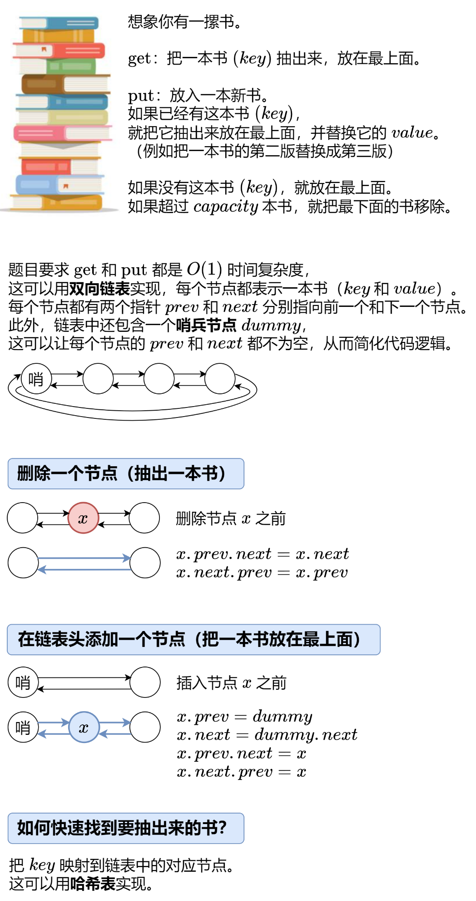

# 146. LRU 缓存

> [LeetCode 原题链接](https://leetcode.cn/problems/lru-cache/)

## 题目描述

请你设计并实现一个满足 LRU (最近最少使用) 缓存 约束的数据结构。

实现 LRUCache 类：

LRUCache(int capacity) 以 正整数 作为容量 capacity 初始化 LRU 缓存 int get(int key) 如果关键字 key 存在于缓存中，则返回关键字的值，否则返回 -1 。 void put(int key, int value) 如果关键字 key 已经存在，则变更其数据值 value ；如果不存在，则向缓存中插入该组 key-value 。如果插入操作导致关键字数量超过 capacity ，则应该 逐出 最久未使用的关键字。 函数 get 和 put 必须以 O(1) 的平均时间复杂度运行。

### 示例

```text
输入
["LRUCache", "put", "put", "get", "put", "get", "put", "get", "get", "get"]
[[2], [1, 1], [2, 2], [1], [3, 3], [2], [4, 4], [1], [3], [4]]
输出
[null, null, null, 1, null, -1, null, -1, 3, 4]

解释
LRUCache lRUCache = new LRUCache(2);
lRUCache.put(1, 1); // 缓存是 {1=1}
lRUCache.put(2, 2); // 缓存是 {1=1, 2=2}
lRUCache.get(1);    // 返回 1
lRUCache.put(3, 3); // 该操作会使得关键字 2 作废，缓存是 {1=1, 3=3}
lRUCache.get(2);    // 返回 -1 (未找到)
lRUCache.put(4, 4); // 该操作会使得关键字 1 作废，缓存是 {4=4, 3=3}
lRUCache.get(1);    // 返回 -1 (未找到)
lRUCache.get(3);    // 返回 3
lRUCache.get(4);    // 返回 4
```

### 提示

- 1 <= capacity <= 3000
- 0 <= key <= 10000
- 0 <= value <= 105
- 最多调用 2 * 105 次 get 和 put

---

## 原文解题记录

也就是最近最久未使用 lastest recently used，在溢出那一刻逆向扫描

使用(put/get)访问都是一个意思

<p align="center"></p>

**答疑**

**问：需要几个哨兵节点？**

答：一个就够了。一开始哨兵节点dummy的prev和next都指向dummy。随着节点的插入，dummy的 next指向链表的第一个节点（最上面的书），prev指向链表的最后一个节点（最下面的书）。

**问：为什么节点要把key也存下来？**

答：在删除链表末尾节点时，也要删除哈希表中的记录，这需要知道末尾节点的key。

**为什么用双向链表而不是单向链表？**

将某个节点移动到链表头部或者将链表尾部节点删去，都要用到删除链表中某个节点这个操作。你想要删除链表中的某个节点，需要找到该节点的前驱节点和后继节点。对于寻找后继节点，单向链表和双向链表都能通过 next 指针在O(1)时间内完成；对于寻找前驱节点，单向链表需要从头开始找，也就是要O(n)时间，双向链表可以通过前向指针直接找到，需要O(1)时间。综上，要想在O(1)时间内完成该操作，当然需要双向链表，实际上就是用双向链表空间换时间了。

实际上单向链表也是可以的，代码会变得很恶心，链表头部存最少访问的元素，在map里存储对应结点的上一个结点，访问、删除时都要多更新当前元素的下一个元素

**为什么链表节点需要同时存储 key 和 value，而不是仅仅只存储 value？**

因为删去最近最少使用的键值对时，要删除链表的尾节点，如果节点中没有存储 key，那么怎么知道是哪个 key 被删除，进而在 map 中删去该 key 对应的 key-value 呢？

因为删去最近最少使用的键值对时，要删除链表的尾节点并且要删除map中的key-value，而如果尾节点没有存储key，那么就找不到要在map中删除哪个key，因此节点必须存储key。

阅读建议：先看写法二，理解核心思路；再看写法一，理解链表细节。

**写法****一****：手写双向链表**

struct Node {

int key;

int value;

Node* prev;

Node* next;

Node(int k = 0, int v = 0) : key(k), value(v) {}

};

class LRUCache {

private:

int capacity;

Node* dummy; // 哨兵节点

unordered_map<int, Node*> key_to_node;

// 删除一个节点（抽出一本书）

void remove(Node* x) {

x->prev->next = x->next;

x->next->prev = x->prev;

}

// 在链表头添加一个节点（把一本书放到最上面）

void push_front(Node* x) {

x->prev = dummy;

x->next = dummy->next;

x->prev->next = x;

x->next->prev = x;

}

// 获取 key 对应的节点，同时把该节点移到链表头部

Node* get_node(int key) {

auto it = key_to_node.find(key);

if (it == key_to_node.end()) { // 没有这本书

return nullptr;

}

Node* node = it->second; // 有这本书

remove(node); // 把这本书抽出来

push_front(node); // 放到最上面

return node;

}

public:

LRUCache(int capacity) : capacity(capacity), dummy(new Node()) {

dummy->prev = dummy;

dummy->next = dummy;

}

int get(int key) {

Node* node = get_node(key); // get_node 会把对应节点移到链表头部

return node ? node->value : -1;

}

void put(int key, int value) {

Node* node = get_node(key); // get_node 会把对应节点移到链表头部

if (node) { // 有这本书

node->value = value; // 更新 value

return;

}

key_to_node[key] = node = new Node(key, value); // 新书

push_front(node); // 放到最上面

if (key_to_node.size() > capacity) { // 书太多了

Node* back_node = dummy->prev;

key_to_node.erase(back_node->key);

remove(back_node); // 去掉最后一本书

delete back_node; // 释放内存

}

}

};

**写法二：标准库**

class LRUCache {

private:

int capacity;

list<pair<int, int>> cache_list; // pair 里面保存的是 key 和 value

unordered_map<int,list<pair<int,int>>::iterator> key_to_iter; //key->链表节点迭代器

public:

LRUCache(int capacity) : capacity(capacity) {}

int get(int key) {

auto umap_iter = key_to_iter.find(key);

if (umap_iter == key_to_iter.end()) { // 没有这本书

return -1;

}

auto list_iter = umap_iter->second; // 有这本书

// 把这本书（list_iter）从书堆（cache_list）中抽出来，放到最上面（cache_list.begin()）

cache_list.splice(cache_list.begin(), cache_list, list_iter);

return list_iter->second; // 返回这本书的 value

}

void put(int key, int value) {

auto umap_iter = key_to_iter.find(key);

if (umap_iter != key_to_iter.end()) { // 有这本书

auto list_iter = umap_iter->second;

list_iter->second = value; // 更新 value

// 把这本书（list_iter）从书堆（cache_list）中抽出来，放到最上面（cache_list.begin()）

cache_list.splice(cache_list.begin(), cache_list, list_iter);

return;

}

// 新书，放到最上面（emplace_front）

cache_list.emplace_front(key, value);

key_to_iter[key] = cache_list.begin();

// 书太多了

if (key_to_iter.size() > capacity) {

// 去掉最后一本书

key_to_iter.erase(cache_list.back().first);

cache_list.pop_back();

}

}

};

**复杂度分析**

时间复杂度：所有操作均为O(1)。

空间复杂度：O(min(p,capacity))，其中p为put的调用次数。

**思考题**

在本题的基础上，为key增加过期时间（put调用时额外传入过期时间）。如果key过期，则需要删除掉。
