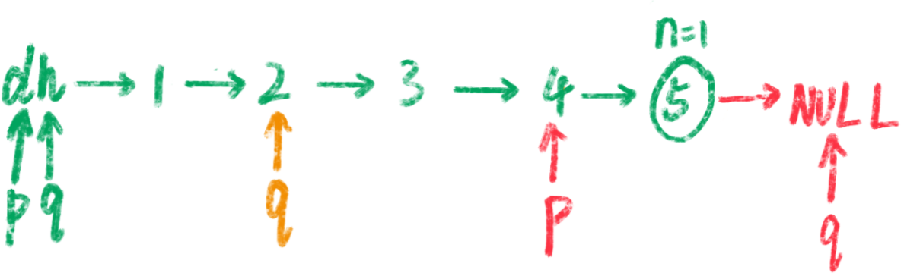

# 19. 删除链表的倒数第 N 个结点

> [LeetCode 原题链接](https://leetcode.cn/problems/remove-nth-node-from-end-of-list/)

## 题目描述

给你一个链表，删除链表的倒数第 n 个结点，并且返回链表的头结点。

### 示例 1

```text
输入：head = [1,2,3,4,5], n = 2
输出：[1,2,3,5]
```

### 示例 2

```text
输入：head = [1], n = 1
输出：[]
```

### 示例 3

```text
输入：head = [1,2], n = 1
输出：[1]
```

### 提示

- 链表中结点的数目为 sz
- 1 <= sz <= 30
- 0 <= Node.val <= 100
- 1 <= n <= sz

进阶：你能尝试使用一趟扫描实现吗？

---

## 原文解题记录

**题目解析**

采取双重遍历肯定是可以解决问题的，但题目要求我们一次遍历解决问题，那我们的思路得发散一下。

**方法一：****双指针**

我们可以设想假设设定了双指针p和q的话，**当q指向末尾的NULL**，p与q之间相隔的元素个数为n时，那么删除掉 p 的下一个指针就完成了要求。

- 设置虚拟节点dummyHead指向head

- 设定双指针p和q，初始都指向虚拟节点dummyHead

- 移动q，直到p与q之间相隔的元素个数为n

- 同时移动p与q，直到q指向的为NULL

- 将p的下一个节点指向下下个节点

<p align="center"></p>

<p align="center"></p>

道理很简单，就是q指针只移动n步时，q与p相距的距离，与找倒数第n个节点时，p随着q移动到末尾的步伐，此时他们俩移动了相同的步子，间隔当然仍然不变了，而且此时q指针指向末尾的空节点，说明此时q也就是链表尾部距离p的距离为n，也就是要删除的倒数第k个节点距离链表末尾的距离。

后半部分与前半部分对称，倒数第k个不好找，我就先找第前k个，然后再同时移动，前变尾，相隔距离不变。

**代码**

class Solution {

public:

ListNode* removeNthFromEnd(ListNode* head, int n) {

ListNode* dummyHead = new ListNode(0);

dummyHead->next = head;

ListNode* p = dummyHead;

ListNode* q = dummyHead;

for( int i = 0 ; i < n + 1 ; i ++ ){

q = q->next;

}

while(q->next){  ///

p = p->next;

q = q->next;

}

ListNode* delNode = p->next;

p->next = delNode->next;

delete delNode;

return dummyHead->next;

}

};

**简洁版本：**

class Solution {

public:

ListNode* removeNthFromEnd(ListNode* head, int n) {

ListNode *dummy = new ListNode(0);

dummy->next = head;

ListNode *p = dummy;

ListNode *q = dummy;

while(n--)

{

q = q->next;

}

while(q->next)

{

p = p -> next;

q = q-> next;

}

p->next = p->next->next;

return dummy->next;

}

};

**三个指针：**

class Solution {

public:

ListNode* removeNthFromEnd(ListNode* head, int n) {

ListNode *dummy = new ListNode(0);

dummy->next = head;

ListNode *p = dummy;

ListNode *q = head;

ListNode *res = head;

while(n--)

{

q = q->next;

}

while(q)

{

p = p -> next;

res = res ->next;

q = q-> next;

}

p->next = res->next;

delete res;

return dummy->next;

}

};

最后返回dummy.next可以避免**删除头节点、头节点本身为None**等特殊情况

**方法二：栈**

**思路与算法**

我们也可以在遍历链表的同时将所有节点依次入栈。根据栈「先进后出」的原则，我们弹出栈的第n个节点就是需要删除的节点，并且目前栈顶的节点就是待删除节点的前驱节点。这样一来，删除操作就变得十分方便了。

**代码**

class Solution {

public:

ListNode* removeNthFromEnd(ListNode* head, int n) {

ListNode* dummy = new ListNode(0, head);

stack<ListNode*> stk;

ListNode* cur = dummy;

while (cur) {

stk.push(cur);

cur = cur->next;

}

for (int i = 0; i < n; ++i) {

stk.pop();

}

ListNode* prev = stk.top();

prev->next = prev->next->next;

ListNode* ans = dummy->next;

delete dummy;

return ans;

}

};

**复杂度分析**

时间复杂度：O(L)，其中 L 是链表的长度。

空间复杂度：O(L)，其中 L 是链表的长度。主要为栈的开销。

**相同思路的递归版本：**

class Solution {

public:

ListNode* removeNthFromEnd(ListNode* head, int n) {

if(head == nullptr)

{

return head;

}

head->next =removeNthFromEnd(head->next, n);

count++;

return count == n ? head->next: head;

}

int count = 0;

};
