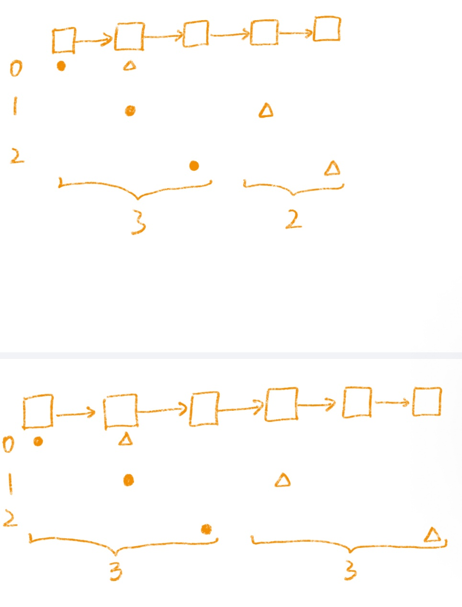
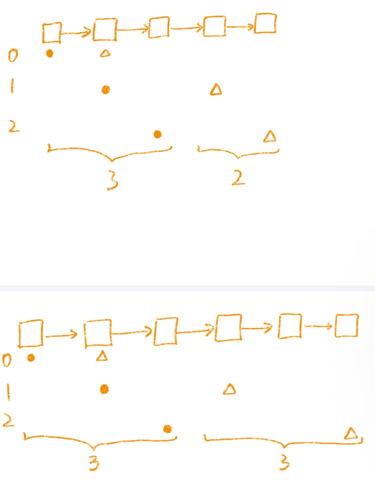

# 234. 回文链表

> [LeetCode 原题链接](https://leetcode.cn/problems/palindrome-linked-list/)

## 题目描述

给你一个单链表的头节点 head ，请你判断该链表是否为回文链表。如果是，返回 true ；否则，返回 false 。

### 示例 1

```text
输入：head = [1,2,2,1]
输出：true
```

### 示例 2

```text
输入：head = [1,2]
输出：false
```

### 提示

- 链表中节点数目在范围[1, 105] 内
- 0 <= Node.val <= 9

进阶：你能否用 O(n) 时间复杂度和 O(1) 空间复杂度解决此题？

---

## 原文解题记录

**方法：快慢指针**

** **

**思路**

避免使用 O(n) 额外空间的方法就是改变输入。

我们可以将链表的后半部分反转（修改链表结构），然后将前半部分和后半部分进行比较。比较完成后我们应该将链表恢复原样。虽然不需要恢复也能通过测试用例，但是使用该函数的人通常不希望链表结构被更改。

该方法虽然可以将空间复杂度降到 O(1)，但是在并发环境下，该方法也有缺点。在并发环境下，函数运行时需要锁定其他线程或进程对链表的访问，因为在函数执行过程中链表会被修改。

**算法整个流程可以分为以下五个步骤：**

- 找到前半部分链表的尾节点。

- 反转后半部分链表。

- 判断是否回文。

- 恢复链表。

- 返回结果。

执行步骤一，我们可以计算链表节点的数量，然后遍历链表找到前半部分的尾节点。

我们也可以使用快慢指针在一次遍历中找到：**慢指针一次走一步，快指针一次走两步，快慢指针同时出发。当快指针移动到链表的末尾时，慢指针恰好到链表的中间。通过慢指针将链表分为两部分。**若链表有奇数个节点，则中间的节点应该看作是前半部分。

步骤二可以使用「206. 反转链表」问题中的解决方法来反转链表的后半部分。

步骤三比较两个部分的值，当后半部分到达末尾则比较完成，可以忽略计数情况中的中间节点。

步骤四与步骤二使用的函数相同，再反转一次恢复链表本身。

如果节点为空，或者为单节点，则天然为回文，返回true。

如果存在多个节点，我们定义快慢双指针。

同时出发，则让p1 p2都从head开始出发，同样也可以让p1从head出发，p2从head->next出发。

我们开始遍历链表，p2走得快，当p2的下一个节点为空时则说明已经遍历到链表末尾。

虽然前面if(!head || !head->next)保证了head->next不为空，所以p2一开始不为空，但while循环里**p2 = p2->next->next**这一步可能会让p2变成nullptr。

举个例子：链表有两个节点[1, 2]

初始：p1 = 1, p2 = 2

进入while：p2->next是nullptr，条件为假，不循环

此时没问题

**但如果链表有三个节点[1, 2, 1]**

**初始：p1 = 1, p2 = 2**

**第一次循环：p1 = 2, p2 = p2->next->next = 1->next = ****nullptr**

**下一轮while判断：p2->next，此时p2已经是****nullptr****，访问****nullptr****->next崩溃**

那么while(p2 && p2->next)

我们在这个循环中具体进行了哪些操作呢？

慢指针：p1 = p1->next;

快指针：p2 = p2 -> next -> next

Ok，接下来我们就是要反转后面那部分的链表了，反转的链表仍然是链表，这个结构要写对。

我们知道一个链表的头节点代表了这个链表，要想进入到这个链表，找它的头节点即可，那么他的头结点是谁呢？我们刚才的循环已经结束，那么第一部分的next就是第二部分的头节点了。那么我们第二部分的链表就可以得到了。

Listnode second = reverseList(p1->next)

这是我们自定义的函数，进入函数

Listnode *reverseList(head)

进去我们要反转链表，具体反转链表的细节不再赘述

ListNode *pre = nullptr;

LisrNode *cur = head;

当前节点不为空时遍历链表，直到末尾时节点为空。

ListNode *next = cur->next;

cur->next = pre;

pre = cur;

cur = next;

循环结束，返回什么？返回的是我们的前驱节点，为什么返回前驱节点？头节点代表着整个链表，pre指向的是原链表的最后一个节点，也就是反转后链表的头节点。

Ok，我们如愿得到了反转的链表，要记得需要更新我们p1->next，此时指向的是空指针。

现在我们第一部分的链表有了，后半部分反转后的链表也有了，开始比较！

那么结束的条件是？第一个链表或第二个链表遍历到末尾时，指针指向空，也就是第一个链表的节点为空，不为空我们就接着循环。

只能是当第二个链表节点为空时停下，不能写第一个链表

为什么while里是second，换成first不行吗

不行。

second 指向的是反转后的后半段链表，长度<=前半段。用 while(second) 遍历后半段，确保每个节点都和前半段对应节点比较。

如果用 while(first)，**前半段可能比后半段长（奇数节点时），会多比较一个多余的节点**，逻辑错误。

而实际上，[1,2,3,2,1]也是一种回文链表，奇数节点剩下那个不用比较，也就是first不必为空。

<p align="center"></p>

图1. 奇数情况

<p align="center"></p>

图2. 偶数情况

当第一部分的值不等于第二部分的值时，返回false，不要只考虑相同的情况，忘记写这一部分。其他情况循环遍历，怎么循环？

first = first->next;

second = second->next;

结束循环，我们返回ture，为什么跳出循环后返回true？因为如果有值不相等，在循环里就已经返回了false。
